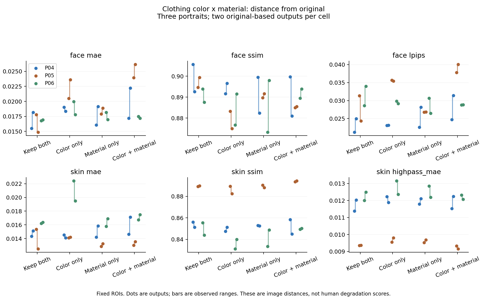

# 의상 색 × 재질 비교 — 24회 새 생성

2026-09-09. 기존 P04/P05/P06에서 색 유지/남색 × 재질 유지/케이블 니트의 네 조건을 두 번씩 새로 생성했다. **24/24 저장, 재시도 0, 픽셀 기준 서로 다른 출력 24장**이다.

요청 내용을 더 많이 바꾼다고 얼굴 차이가 항상 커지지는 않았다. P05에서는 색 변경에 따른 얼굴 LPIPS 증가가 보였으나 P06의 평균은 색·재질을 바꾼 조건이 변경 없는 조건보다 낮기도 했다. 재질 단독 변화의 얼굴·피부 지표 방향도 인물과 지표에 따라 달랐다. 따라서 이 네 조건을 보편적인 열화 강도 순서로 사용할 수 없다. 두 반복만으로 효과가 없다고 확정할 수도 없다.

## 사전 계획과 실행

[계획](PROTOCOL.md) · [모든 프롬프트·입력·영역](plan.json). 24개 모두 같은 인물의 원본부터 1회 생성했으므로 생성 횟수는 같다. gray_original은 변경 없는 요청, navy_original은 색만 남색, gray_cable은 재질만 케이블 니트, navy_cable은 두 가지 변경이다. 배경과 얼굴·신체·옷 외곽은 유지하도록 요청했다. 실제 케이블 두께·색조·접힘까지 통제한 물리적 강도 실험은 아니다.

첫 출력은 모두 보존했다. P06-gray_original-r1에서는 원본에 없던 수평 흰 줄무늬가 생겼다. P06-gray_original-r2에는 그 줄무늬가 없다. 변경 없는 프롬프트도 전체 이미지 보존을 보장하지 않는 실행 사례이며, 해당 출력을 제외하거나 재시도하지 않았다. 케이블 요청은 가시적으로 반영됐지만 목·소매·밑단의 짜임과 두께가 달라졌다. 이러한 생성 담당자의 비블라인드 관찰은 독립 평가 점수나 성공률이 아니다.

## 고정 영역 결과

평균 [최소, 최대], 각 셀 두 출력. 낮은 MAE/LPIPS/고주파 MAE와 높은 SSIM은 원본에 가까움을 뜻한다. 얼굴 사각형에는 머리·배경도 포함된다. 범위는 신뢰구간이 아니다.

| 인물 | 조건 | 얼굴 MAE | 얼굴 SSIM | 얼굴 LPIPS | 피부 MAE | 피부 SSIM | 피부 고주파 MAE |
| --- | --- | --- | --- | --- | --- | --- | --- |
| P04 | gray_original | 0.016832 [0.015507, 0.018158] | 0.899125 [0.892612, 0.905637] | 0.023085 [0.021179, 0.024991] | 0.014721 [0.014323, 0.015118] | 0.853674 [0.851310, 0.856038] | 0.011705 [0.011382, 0.012029] |
| P04 | navy_original | 0.018675 [0.018336, 0.019015] | 0.894121 [0.891662, 0.896579] | 0.023126 [0.023106, 0.023146] | 0.014313 [0.014091, 0.014535] | 0.849385 [0.847583, 0.851187] | 0.012057 [0.011890, 0.012223] |
| P04 | gray_cable | 0.017612 [0.016070, 0.019155] | 0.890935 [0.882401, 0.899468] | 0.025344 [0.022554, 0.028134] | 0.015016 [0.014190, 0.015843] | 0.852754 [0.852503, 0.853005] | 0.011953 [0.011791, 0.012115] |
| P04 | navy_cable | 0.019700 [0.017194, 0.022206] | 0.890364 [0.881002, 0.899725] | 0.028059 [0.024683, 0.031436] | 0.015879 [0.014646, 0.017111] | 0.851753 [0.845036, 0.858469] | 0.011884 [0.011531, 0.012237] |
| P05 | gray_original | 0.016305 [0.014843, 0.017768] | 0.897031 [0.894651, 0.899410] | 0.027822 [0.024317, 0.031327] | 0.013928 [0.012499, 0.015357] | 0.889464 [0.889159, 0.889768] | 0.009362 [0.009351, 0.009373] |
| P05 | navy_original | 0.022051 [0.020483, 0.023620] | 0.879113 [0.874944, 0.883282] | 0.035544 [0.035391, 0.035696] | 0.014160 [0.014113, 0.014208] | 0.885888 [0.882440, 0.889337] | 0.009679 [0.009558, 0.009801] |
| P05 | gray_cable | 0.018398 [0.017903, 0.018892] | 0.890645 [0.889679, 0.891611] | 0.026826 [0.026788, 0.026865] | 0.013061 [0.012866, 0.013257] | 0.889274 [0.888027, 0.890521] | 0.009610 [0.009532, 0.009689] |
| P05 | navy_cable | 0.025052 [0.023933, 0.026170] | 0.885200 [0.884907, 0.885492] | 0.038948 [0.037823, 0.040074] | 0.013298 [0.013034, 0.013561] | 0.893941 [0.893526, 0.894355] | 0.009247 [0.009159, 0.009335] |
| P06 | gray_original | 0.016851 [0.016769, 0.016934] | 0.890669 [0.887488, 0.893850] | 0.031296 [0.028598, 0.033995] | 0.016298 [0.016219, 0.016378] | 0.849727 [0.843935, 0.855518] | 0.012251 [0.012004, 0.012498] |
| P06 | navy_original | 0.018858 [0.017771, 0.019946] | 0.884111 [0.876702, 0.891520] | 0.029501 [0.029173, 0.029829] | 0.020956 [0.019503, 0.022409] | 0.835602 [0.831218, 0.839986] | 0.012758 [0.012364, 0.013152] |
| P06 | gray_cable | 0.017552 [0.016946, 0.018157] | 0.885573 [0.873181, 0.897966] | 0.028570 [0.026469, 0.030670] | 0.016341 [0.015791, 0.016891] | 0.841213 [0.833598, 0.848827] | 0.012517 [0.012191, 0.012844] |
| P06 | navy_cable | 0.017339 [0.017195, 0.017483] | 0.891691 [0.889509, 0.893873] | 0.028812 [0.028754, 0.028869] | 0.017112 [0.016746, 0.017477] | 0.849860 [0.849473, 0.850247] | 0.012192 [0.012069, 0.012315] |



[PDF](factor-comparison.pdf) · [SVG](factor-comparison.svg)

## 사전 정의한 대비

color_at_original=기존 재질에서 남색−회색 유지, color_at_cable=니트에서 같은 색 대비. material_at_gray=기존 색에서 니트−기존 재질, material_at_navy=남색에서 같은 재질 대비. interaction=(니트의 색 대비)−(기존 재질의 색 대비). 아래는 지표 원래 방향의 차이다. SSIM의 음수는 원본과 덜 비슷함을 뜻한다.

| 인물 | 대비 | 얼굴 MAE | 얼굴 SSIM | 얼굴 LPIPS | 피부 MAE | 피부 SSIM | 피부 고주파 MAE |
| --- | --- | --- | --- | --- | --- | --- | --- |
| P04 | color_at_original | +0.001843 | -0.005004 | +0.000041 | -0.000408 | -0.004288 | +0.000351 |
| P04 | color_at_cable | +0.002088 | -0.000571 | +0.002715 | +0.000862 | -0.001001 | -0.000069 |
| P04 | material_at_gray | +0.000780 | -0.008190 | +0.002259 | +0.000296 | -0.000920 | +0.000248 |
| P04 | material_at_navy | +0.001025 | -0.003757 | +0.004933 | +0.001566 | +0.002368 | -0.000173 |
| P04 | interaction | +0.000245 | +0.004433 | +0.002674 | +0.001270 | +0.003287 | -0.000420 |
| P05 | color_at_original | +0.005746 | -0.017918 | +0.007722 | +0.000232 | -0.003575 | +0.000318 |
| P05 | color_at_cable | +0.006654 | -0.005446 | +0.012122 | +0.000236 | +0.004666 | -0.000363 |
| P05 | material_at_gray | +0.002092 | -0.006385 | -0.000996 | -0.000866 | -0.000189 | +0.000249 |
| P05 | material_at_navy | +0.003000 | +0.006087 | +0.003405 | -0.000863 | +0.008052 | -0.000432 |
| P05 | interaction | +0.000908 | +0.012472 | +0.004400 | +0.000004 | +0.008242 | -0.000681 |
| P06 | color_at_original | +0.002007 | -0.006558 | -0.001795 | +0.004657 | -0.014125 | +0.000507 |
| P06 | color_at_cable | -0.000212 | +0.006117 | +0.000242 | +0.000770 | +0.008647 | -0.000325 |
| P06 | material_at_gray | +0.000700 | -0.005095 | -0.002726 | +0.000043 | -0.008514 | +0.000266 |
| P06 | material_at_navy | -0.001519 | +0.007580 | -0.000690 | -0.003844 | +0.014258 | -0.000565 |
| P06 | interaction | -0.002219 | +0.012675 | +0.002037 | -0.003887 | +0.022772 | -0.000831 |

두 반복 블록의 대비도 [contrasts.json](contrasts.json)에 보존했고, 그 평균이 셀 평균의 대비와 일치하는지 검사했다. 블록 번호가 같은 것은 생성 seed를 맞춘 짝이 아니다. 이 수치를 유의한 상호작용이나 인과적인 피부 열화 효과로 부르지 않는다.

## 평균색 제거 잔차

| 인물 | 조건 | 피부 원시 MAE | 평균색 제거 잔차 MAE | MSE 평균색 항 비율 |
| --- | --- | --- | --- | --- |
| P04 | gray_original | 0.014721 | 0.013203 | 16.5% |
| P04 | navy_original | 0.014313 | 0.013659 | 8.2% |
| P04 | gray_cable | 0.015016 | 0.013441 | 16.3% |
| P04 | navy_cable | 0.015879 | 0.013434 | 23.2% |
| P05 | gray_original | 0.013928 | 0.011330 | 29.0% |
| P05 | navy_original | 0.014160 | 0.011807 | 25.6% |
| P05 | gray_cable | 0.013061 | 0.011395 | 20.6% |
| P05 | navy_cable | 0.013298 | 0.010969 | 29.2% |
| P06 | gray_original | 0.016298 | 0.013773 | 24.8% |
| P06 | navy_original | 0.020956 | 0.014817 | 43.9% |
| P06 | gray_cable | 0.016341 | 0.014091 | 22.0% |
| P06 | navy_cable | 0.017112 | 0.013966 | 29.1% |

영역별 RGB 평균 차이를 제거한 잔차도 계산했다. MSE 항등식과 동일 입력·상수 오프셋 대조 검사를 통과했다. MSE 비율은 수학적 분해이며 조명 기여율이나 열화 비율이 아니다. MAE는 가산 분해되지 않는다. [원시 색 진단](color-results.json).

## NCC sigma3 보조 결과

| 인물 | 조건 | 얼굴 MAE | 얼굴 SSIM | 얼굴 LPIPS | 피부 MAE | 피부 SSIM | 피부 고주파 MAE |
| --- | --- | --- | --- | --- | --- | --- | --- |
| P04 | gray_original | 0.016828 [0.015507, 0.018149] | 0.897346 [0.889054, 0.905637] | 0.023542 [0.021179, 0.025904] | 0.014814 [0.014323, 0.015305] | 0.844608 [0.833178, 0.856038] | 0.012055 [0.011382, 0.012727] |
| P04 | navy_original | 0.019150 [0.018754, 0.019547] | 0.884608 [0.881821, 0.887395] | 0.024178 [0.023893, 0.024463] | 0.015070 [0.015026, 0.015113] | 0.821961 [0.821939, 0.821983] | 0.013255 [0.013225, 0.013284] |
| P04 | gray_cable | 0.017456 [0.016070, 0.018841] | 0.891473 [0.883479, 0.899468] | 0.024979 [0.022554, 0.027404] | 0.015032 [0.014190, 0.015874] | 0.841711 [0.830416, 0.853005] | 0.012372 [0.011791, 0.012954] |
| P04 | navy_cable | 0.019023 [0.017194, 0.020853] | 0.895805 [0.891885, 0.899725] | 0.027247 [0.024683, 0.029811] | 0.015856 [0.014646, 0.017067] | 0.844347 [0.830224, 0.858469] | 0.012168 [0.011531, 0.012804] |
| P05 | gray_original | 0.016305 [0.014843, 0.017768] | 0.897031 [0.894651, 0.899410] | 0.027822 [0.024317, 0.031327] | 0.013928 [0.012499, 0.015357] | 0.889464 [0.889159, 0.889768] | 0.009362 [0.009351, 0.009373] |
| P05 | navy_original | 0.022002 [0.021000, 0.023004] | 0.868228 [0.866122, 0.870333] | 0.035348 [0.034471, 0.036225] | 0.015393 [0.015337, 0.015450] | 0.858215 [0.855288, 0.861142] | 0.011120 [0.011104, 0.011135] |
| P05 | gray_cable | 0.018398 [0.017903, 0.018892] | 0.890645 [0.889679, 0.891611] | 0.026826 [0.026788, 0.026865] | 0.013061 [0.012866, 0.013257] | 0.889274 [0.888027, 0.890521] | 0.009610 [0.009532, 0.009689] |
| P05 | navy_cable | 0.028333 [0.024884, 0.031782] | 0.830508 [0.797111, 0.863905] | 0.045782 [0.040901, 0.050662] | 0.016102 [0.014602, 0.017602] | 0.831413 [0.798950, 0.863876] | 0.011831 [0.011034, 0.012628] |
| P06 | gray_original | 0.017034 [0.016769, 0.017299] | 0.885335 [0.876820, 0.893850] | 0.030731 [0.028598, 0.032864] | 0.016194 [0.016169, 0.016219] | 0.845068 [0.834618, 0.855518] | 0.012571 [0.012004, 0.013138] |
| P06 | navy_original | 0.019424 [0.018566, 0.020282] | 0.867094 [0.857882, 0.876306] | 0.030227 [0.029903, 0.030551] | 0.019815 [0.019280, 0.020350] | 0.814352 [0.807092, 0.821612] | 0.013994 [0.013613, 0.014374] |
| P06 | gray_cable | 0.016578 [0.016211, 0.016946] | 0.893029 [0.888092, 0.897966] | 0.026622 [0.026469, 0.026774] | 0.016402 [0.015912, 0.016891] | 0.845743 [0.842658, 0.848827] | 0.012627 [0.012191, 0.013063] |
| P06 | navy_cable | 0.019209 [0.018587, 0.019831] | 0.865428 [0.858651, 0.872204] | 0.032361 [0.030579, 0.034142] | 0.018093 [0.017659, 0.018527] | 0.810174 [0.802117, 0.818232] | 0.013976 [0.013838, 0.014113] |

sigma1/6은 [CSV](metrics.csv)에 모두 있다. NCC 검색 경계 도달은 0이며 정렬로 제거할 수 없는 색·형태 차이는 남는다.

## 개별 출력 전체

| 출력 | 얼굴 MAE | 얼굴 SSIM | 얼굴 LPIPS | 피부 MAE | 피부 SSIM | 피부 고주파 MAE |
| --- | --- | --- | --- | --- | --- | --- |
| P06-navy_cable-r1 | 0.017483 | 0.889509 | 0.028754 | 0.016746 | 0.849473 | 0.012315 |
| P04-gray_cable-r1 | 0.016070 | 0.899468 | 0.022554 | 0.014190 | 0.853005 | 0.011791 |
| P05-gray_cable-r1 | 0.017903 | 0.889679 | 0.026788 | 0.012866 | 0.890521 | 0.009532 |
| P04-navy_cable-r1 | 0.017194 | 0.899725 | 0.024683 | 0.014646 | 0.858469 | 0.011531 |
| P05-gray_original-r1 | 0.017768 | 0.894651 | 0.031327 | 0.015357 | 0.889159 | 0.009351 |
| P06-gray_original-r1 | 0.016769 | 0.893850 | 0.028598 | 0.016219 | 0.855518 | 0.012004 |
| P06-gray_cable-r1 | 0.018157 | 0.873181 | 0.030670 | 0.015791 | 0.833598 | 0.012844 |
| P04-navy_original-r1 | 0.019015 | 0.891662 | 0.023106 | 0.014535 | 0.847583 | 0.012223 |
| P05-navy_cable-r1 | 0.023933 | 0.884907 | 0.037823 | 0.013034 | 0.893526 | 0.009335 |
| P04-gray_original-r1 | 0.015507 | 0.905637 | 0.021179 | 0.014323 | 0.856038 | 0.011382 |
| P05-navy_original-r1 | 0.020483 | 0.883282 | 0.035696 | 0.014113 | 0.889337 | 0.009558 |
| P06-navy_original-r1 | 0.019946 | 0.876702 | 0.029829 | 0.022409 | 0.831218 | 0.013152 |
| P06-gray_original-r2 | 0.016934 | 0.887488 | 0.033995 | 0.016378 | 0.843935 | 0.012498 |
| P05-navy_cable-r2 | 0.026170 | 0.885492 | 0.040074 | 0.013561 | 0.894355 | 0.009159 |
| P06-gray_cable-r2 | 0.016946 | 0.897966 | 0.026469 | 0.016891 | 0.848827 | 0.012191 |
| P05-navy_original-r2 | 0.023620 | 0.874944 | 0.035391 | 0.014208 | 0.882440 | 0.009801 |
| P04-gray_original-r2 | 0.018158 | 0.892612 | 0.024991 | 0.015118 | 0.851310 | 0.012029 |
| P05-gray_cable-r2 | 0.018892 | 0.891611 | 0.026865 | 0.013257 | 0.888027 | 0.009689 |
| P04-navy_cable-r2 | 0.022206 | 0.881002 | 0.031436 | 0.017111 | 0.845036 | 0.012237 |
| P04-navy_original-r2 | 0.018336 | 0.896579 | 0.023146 | 0.014091 | 0.851187 | 0.011890 |
| P06-navy_cable-r2 | 0.017195 | 0.893873 | 0.028869 | 0.017477 | 0.850247 | 0.012069 |
| P06-navy_original-r2 | 0.017771 | 0.891520 | 0.029173 | 0.019503 | 0.839986 | 0.012364 |
| P04-gray_cable-r2 | 0.019155 | 0.882401 | 0.028134 | 0.015843 | 0.852503 | 0.012115 |
| P05-gray_original-r2 | 0.014843 | 0.899410 | 0.024317 | 0.012499 | 0.889768 | 0.009373 |

## 사후 공간 진단

줄무늬 사례를 확인한 뒤 셔츠 내부와 좌우 배경 띠의 MAE·SSIM·평균색 제거 잔차를 24개 모두에서 추가 계산했다. [사후 계획](POSTHOC_SPATIAL.md) · [결과](SPATIAL_RESULTS.md). 편집 조건의 셔츠 차이는 의도한 변화도 포함하므로 낮을수록 성공이라는 지표가 아니다.

## 검증과 재현

입력·출력·호출 기록 해시, 최초 호출, 크기1024×1536, 3인물×4조건×2반복 완전성을 검사했다. 동일 조건 두 반복의 프롬프트가 같다. 원본/직전 입력은 동일하지만 일관된 데이터 형식을 위해 둘 다 저장했다. 이를 독립 관측 두 개로 세지 않는다. 고정 얼굴 MAE/SSIM 48쌍 재계산, CSV 960행 및 집계 검증을 통과했다. [검증 기록](verification.json) · [환경·파일 해시](manifest.json).

```sh
.venv-metrics/bin/python experiments/edit-factors-v1/analyze.py
.venv-metrics/bin/python experiments/edit-factors-v1/verify.py
.venv-metrics/bin/python experiments/edit-factors-v1/color_diagnostic.py
.venv-metrics/bin/python experiments/edit-factors-v1/report.py
```

사람의 자연스러움·정체성·편집 성공과 자동 지표의 일치는 이번 자료로 답할 수 없다. 기존 생성 인물 세 명과 노출되지 않은 모델 버전에 한정된 탐색 결과다. 유의성 검정·학습 임계값·지각적 강도 정답을 만들지 않았다.
