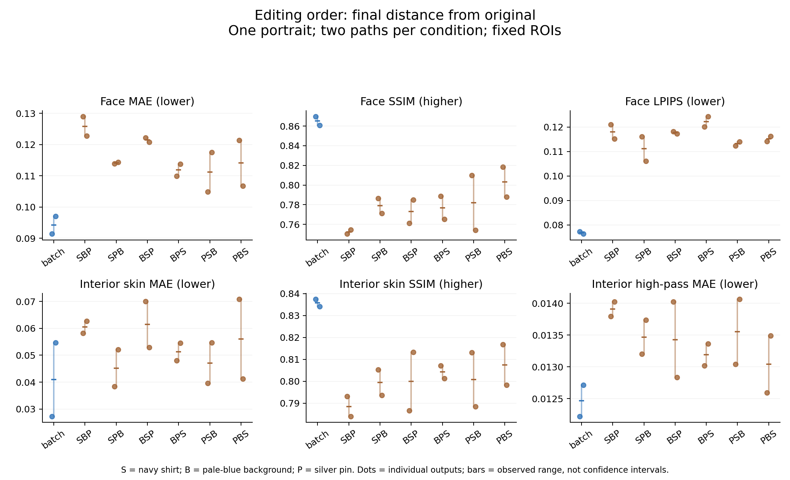

# 편집 순서 6종 비교 — 38회 새 생성 결과

2026-09-09. 사람 평가 없이 P04 한 인물에서 6순열×2반복×3단계와 일괄 편집 2회를 실행했다. **38/38 성공, 재시도 0, 픽셀 기준 서로 다른 출력 38장**이다. 기존 14회 실험과 별도 날짜·설계의 자료이며 합산하지 않는다.

## 관측된 결과와 해석

일괄 편집의 두 최종 출력은 모든 순차 출력보다 고정 얼굴 ROI의 LPIPS·MAE가 낮고 SSIM이 높았다. 하지만 여섯 순차 순서 사이의 우열은 지표와 반복에 따라 달라져 **현재 자료로 최적 편집 순서를 정할 수 없다.** 피부 내부 지표는 개별 반복의 범위가 겹치므로 얼굴 사각형의 결과를 그대로 피부의 확정 우열로 바꾸지 않는다.

첫 단계 단독 편집에서는 배경 변경의 차이가 컸다. 사후 평균색 분리에서는 그 피부 MSE의 상당 부분이 영역별 평균색 항에 해당했다. 따라서 배경 변경 후의 큰 MAE를 곧 질감 열화로 부르면 안 된다. 평균색을 제거한 잔차도 남지만 그것 역시 열화 정답은 아니다.

## 설계

[사전 고정 계획](PROTOCOL.md) · [38개 프롬프트와 입력 계획](plan.json). S=셔츠 남색, B=배경 옅은 파랑, P=보는 사람 기준 오른쪽 가슴의 은색 원형 핀. 모든 경로의 최종 프롬프트가 같고, 중간 프롬프트도 완료된 요구를 S/B/P 정규 순서로 나열했다. 각 반복 블록의 경로 순서는 사전 난수로 섞었다. 실제 생성 seed·내부 모델 버전은 노출되지 않았다.

원본은 기존 P04, 크기는 모두 1024×1536. 기존 얼굴 ROI [352,88,672,448]와 기존 이마·양 볼 영역을 사용했다. 모든 경로는 원본부터 새로 생성했고 첫 단계가 같아도 결과를 공유하지 않았다. 단계와 인물·경로를 구분하며 38장을 독립 인물 38명처럼 세지 않는다.

내장 `image_gen.imagegen`의 첫 출력만 보존했다. 생성 담당자는 최종 14장에 셔츠·배경·핀 요청이 가시적으로 반영된 것을 점검했다. 핀 위치·크기·배경 색조의 미세 차이가 있어 요구 구현이 픽셀 수준에서 동일하지는 않다. 이는 비블라인드 실행 점검이며 사람 평가나 독립 AI 점수가 아니다.

## 최종 고정 ROI 결과

평균 [최소, 최대]. 범위는 두 관측값이며 신뢰구간이 아니다. MAE·LPIPS·고주파 MAE는 낮을수록, SSIM은 높을수록 원본에 가깝다.

| 조건 | 얼굴 MAE ↓ | 얼굴 SSIM ↑ | 얼굴 LPIPS ↓ | 피부 MAE ↓ | 피부 SSIM ↑ | 피부 고주파 MAE ↓ |
| --- | --- | --- | --- | --- | --- | --- |
| batch | 0.094260 [0.091400, 0.097120] | 0.865227 [0.860867, 0.869586] | 0.076800 [0.076301, 0.077299] | 0.040988 [0.027320, 0.054655] | 0.835825 [0.834092, 0.837558] | 0.012468 [0.012223, 0.012713] |
| SBP | 0.125853 [0.122754, 0.128953] | 0.752375 [0.750220, 0.754531] | 0.118081 [0.115161, 0.121002] | 0.060461 [0.058260, 0.062662] | 0.788537 [0.784026, 0.793047] | 0.013907 [0.013792, 0.014022] |
| SPB | 0.114144 [0.113904, 0.114385] | 0.778926 [0.771277, 0.786575] | 0.111104 [0.106063, 0.116145] | 0.045188 [0.038331, 0.052044] | 0.799439 [0.793650, 0.805228] | 0.013468 [0.013201, 0.013735] |
| BSP | 0.121517 [0.120769, 0.122264] | 0.773138 [0.761131, 0.785144] | 0.117738 [0.117245, 0.118231] | 0.061430 [0.052893, 0.069967] | 0.799991 [0.786635, 0.813347] | 0.013427 [0.012833, 0.014021] |
| BPS | 0.111880 [0.109986, 0.113775] | 0.776972 [0.765392, 0.788552] | 0.122222 [0.120192, 0.124252] | 0.051263 [0.048034, 0.054492] | 0.804227 [0.801331, 0.807123] | 0.013192 [0.013019, 0.013364] |
| PSB | 0.111206 [0.104859, 0.117553] | 0.781891 [0.753970, 0.809813] | 0.113233 [0.112426, 0.114041] | 0.047139 [0.039658, 0.054620] | 0.800791 [0.788378, 0.813204] | 0.013554 [0.013041, 0.014067] |
| PBS | 0.114097 [0.106781, 0.121412] | 0.803198 [0.788022, 0.818374] | 0.115256 [0.114201, 0.116311] | 0.056076 [0.041265, 0.070888] | 0.807551 [0.798236, 0.816865] | 0.013043 [0.012595, 0.013490] |



[PDF](final-comparison.pdf) · [SVG](final-comparison.svg)

## 반복별 최종값과 순위 안정성

| 순서 | 반복 | 얼굴 MAE ↓ | 얼굴 SSIM ↑ | 얼굴 LPIPS ↓ | 피부 MAE ↓ | 피부 SSIM ↑ | 피부 고주파 MAE ↓ |
| --- | --- | --- | --- | --- | --- | --- | --- |
| batch | 1 | 0.091400 | 0.869586 | 0.077299 | 0.027320 | 0.837558 | 0.012223 |
| batch | 2 | 0.097120 | 0.860867 | 0.076301 | 0.054655 | 0.834092 | 0.012713 |
| SBP | 1 | 0.128953 | 0.750220 | 0.121002 | 0.058260 | 0.793047 | 0.013792 |
| SBP | 2 | 0.122754 | 0.754531 | 0.115161 | 0.062662 | 0.784026 | 0.014022 |
| SPB | 1 | 0.113904 | 0.786575 | 0.116145 | 0.038331 | 0.805228 | 0.013201 |
| SPB | 2 | 0.114385 | 0.771277 | 0.106063 | 0.052044 | 0.793650 | 0.013735 |
| BSP | 1 | 0.122264 | 0.761131 | 0.118231 | 0.069967 | 0.786635 | 0.014021 |
| BSP | 2 | 0.120769 | 0.785144 | 0.117245 | 0.052893 | 0.813347 | 0.012833 |
| BPS | 1 | 0.109986 | 0.788552 | 0.120192 | 0.048034 | 0.807123 | 0.013019 |
| BPS | 2 | 0.113775 | 0.765392 | 0.124252 | 0.054492 | 0.801331 | 0.013364 |
| PSB | 1 | 0.104859 | 0.809813 | 0.112426 | 0.039658 | 0.813204 | 0.013041 |
| PSB | 2 | 0.117553 | 0.753970 | 0.114041 | 0.054620 | 0.788378 | 0.014067 |
| PBS | 1 | 0.121412 | 0.818374 | 0.114201 | 0.070888 | 0.816865 | 0.012595 |
| PBS | 2 | 0.106781 | 0.788022 | 0.116311 | 0.041265 | 0.798236 | 0.013490 |

| 지표 (원본에 가까운 순) | 반복 1 | 반복 2 |
| --- | --- | --- |
| face/mae | PSB → BPS → SPB → PBS → BSP → SBP | PBS → BPS → SPB → PSB → BSP → SBP |
| face/ssim | PBS → PSB → BPS → SPB → BSP → SBP | PBS → BSP → SPB → BPS → SBP → PSB |
| face/lpips | PSB → PBS → SPB → BSP → BPS → SBP | SPB → PSB → SBP → PBS → BSP → BPS |
| skin/mae | SPB → PSB → BPS → SBP → BSP → PBS | PBS → SPB → BSP → BPS → PSB → SBP |
| skin/ssim | PBS → PSB → BPS → SPB → SBP → BSP | BSP → BPS → PBS → SPB → PSB → SBP |
| skin/highpass_mae | PBS → BPS → PSB → SPB → SBP → BSP | BSP → BPS → PBS → SPB → SBP → PSB |

순위표는 효과 크기·불확실성을 대신하지 않는다. 같은 마지막 편집을 가진 BSP/SBP, BPS/PBS, PSB/SPB도 위 모든 값에 포함했다. 한 지표에서의 순위를 최적 순서로 선택하지 않는다.

## 같은 원본에서 시작한 단독 편집

첫 단계의 S·B·P는 각각 네 번 호출됐다. 후속 단계가 서로 다른 경로에서 나온 첫 출력이지만 모두 같은 원본과 같은 해당 단독 프롬프트를 사용했다.

| 조건 | 얼굴 MAE ↓ | 얼굴 SSIM ↑ | 얼굴 LPIPS ↓ | 피부 MAE ↓ | 피부 SSIM ↑ | 피부 고주파 MAE ↓ |
| --- | --- | --- | --- | --- | --- | --- |
| S 단독 (4회) | 0.019141 [0.015962, 0.021675] | 0.888039 [0.874901, 0.909512] | 0.026270 [0.023696, 0.030730] | 0.015323 [0.013258, 0.017111] | 0.845736 [0.836300, 0.859857] | 0.012156 [0.011162, 0.012812] |
| B 단독 (4회) | 0.109966 [0.102703, 0.118283] | 0.852926 [0.844511, 0.868079] | 0.084844 [0.082589, 0.088873] | 0.049207 [0.038070, 0.056940] | 0.838047 [0.830240, 0.846693] | 0.012495 [0.011809, 0.012964] |
| P 단독 (4회) | 0.016231 [0.014552, 0.018844] | 0.910371 [0.905621, 0.916233] | 0.021354 [0.020143, 0.022572] | 0.014845 [0.013708, 0.015481] | 0.858585 [0.855627, 0.865429] | 0.011258 [0.010929, 0.011468] |

## 같은 요구 집합을 가진 두 단계 비교

SB와 BS, SP와 PS, BP와 PB는 생성 횟수와 완료 요구 집합이 같다. 다만 중간 출력·실현된 색조·질감까지 동일하지는 않다. 둘씩 비교할 때에도 두 관측 범위와 지표 차이를 함께 봐야 한다.

| 조건 | 얼굴 MAE ↓ | 얼굴 SSIM ↑ | 얼굴 LPIPS ↓ | 피부 MAE ↓ | 피부 SSIM ↑ | 피부 고주파 MAE ↓ |
| --- | --- | --- | --- | --- | --- | --- |
| SB | 0.121834 [0.117530, 0.126138] | 0.793139 [0.787019, 0.799258] | 0.101558 [0.101216, 0.101900] | 0.057768 [0.057663, 0.057872] | 0.813543 [0.805607, 0.821479] | 0.013261 [0.013035, 0.013487] |
| BS | 0.118323 [0.116986, 0.119660] | 0.800369 [0.788535, 0.812202] | 0.100156 [0.099007, 0.101304] | 0.058427 [0.053878, 0.062976] | 0.809455 [0.794206, 0.824705] | 0.013483 [0.012812, 0.014154] |
| SP | 0.023476 [0.022940, 0.024013] | 0.860960 [0.854194, 0.867725] | 0.043045 [0.042328, 0.043762] | 0.017611 [0.017247, 0.017975] | 0.832993 [0.827148, 0.838837] | 0.012233 [0.011916, 0.012551] |
| PS | 0.025318 [0.022809, 0.027827] | 0.857570 [0.846223, 0.868917] | 0.041448 [0.039127, 0.043769] | 0.018693 [0.018295, 0.019090] | 0.829574 [0.821331, 0.837817] | 0.012418 [0.012058, 0.012779] |
| BP | 0.110008 [0.107541, 0.112475] | 0.826303 [0.823463, 0.829142] | 0.104365 [0.103352, 0.105377] | 0.049830 [0.044738, 0.054921] | 0.826874 [0.825907, 0.827840] | 0.012495 [0.012479, 0.012511] |
| PB | 0.112206 [0.104331, 0.120081] | 0.834637 [0.823596, 0.845678] | 0.100554 [0.099305, 0.101804] | 0.052294 [0.037706, 0.066883] | 0.824052 [0.813596, 0.834508] | 0.012578 [0.012030, 0.013127] |

전체 단계×추가 편집 셀은 각 4관측이며 [results.json](results.json)의 `summary`에 원본 및 직전 입력 기준으로 모두 보존했다. 이전에 완료된 요구 집합이 달라 이 셀 평균을 순수 편집 종류의 인과효과라고 부르지 않는다.

## NCC sigma3 보조 결과

| 조건 | 얼굴 MAE ↓ | 얼굴 SSIM ↑ | 얼굴 LPIPS ↓ | 피부 MAE ↓ | 피부 SSIM ↑ | 피부 고주파 MAE ↓ |
| --- | --- | --- | --- | --- | --- | --- |
| batch | 0.094260 [0.091400, 0.097120] | 0.865227 [0.860867, 0.869586] | 0.076800 [0.076301, 0.077299] | 0.040988 [0.027320, 0.054655] | 0.835825 [0.834092, 0.837558] | 0.012468 [0.012223, 0.012713] |
| SBP | 0.120745 [0.118339, 0.123151] | 0.802132 [0.796413, 0.807852] | 0.107624 [0.107582, 0.107667] | 0.058234 [0.055734, 0.060733] | 0.780484 [0.767902, 0.793065] | 0.014339 [0.013772, 0.014906] |
| SPB | 0.110337 [0.110022, 0.110653] | 0.813633 [0.811806, 0.815460] | 0.104358 [0.100066, 0.108650] | 0.044678 [0.037947, 0.051408] | 0.801532 [0.797647, 0.805417] | 0.013393 [0.013279, 0.013507] |
| BSP | 0.118582 [0.118197, 0.118967] | 0.800880 [0.798470, 0.803289] | 0.114320 [0.112166, 0.116474] | 0.060204 [0.050764, 0.069644] | 0.794855 [0.788650, 0.801059] | 0.013740 [0.013671, 0.013809] |
| BPS | 0.108278 [0.107207, 0.109349] | 0.809443 [0.805039, 0.813846] | 0.117671 [0.116546, 0.118796] | 0.050459 [0.048410, 0.052508] | 0.792861 [0.785757, 0.799964] | 0.014002 [0.013752, 0.014252] |
| PSB | 0.108029 [0.104859, 0.111198] | 0.811522 [0.809813, 0.813232] | 0.108864 [0.105301, 0.112426] | 0.046835 [0.039658, 0.054012] | 0.804870 [0.796536, 0.813204] | 0.013252 [0.013041, 0.013463] |
| PBS | 0.112339 [0.103265, 0.121412] | 0.819715 [0.818374, 0.821056] | 0.112891 [0.111581, 0.114201] | 0.056047 [0.041207, 0.070888] | 0.807646 [0.798426, 0.816865] | 0.013057 [0.012595, 0.013519] |

sigma1/6도 모두 [CSV](metrics.csv)에 보존했다. 검색 경계에 도달한 경우는 원본·직전 기준 모두 0이다. NCC 보정은 정수 이동만 다루며 색·밝기·변형을 제거하지 않는다.

## 사후 진단: 피부 평균색과 잔차

[추가 계획](POSTHOC_COLOR.md)은 첫 단계 수치를 본 뒤 작성했다. d=출력−원본, b=영역별 RGB 평균(d), e=d−b로 나눴다. MSE=평균색 MSE+잔차 MSE 항등식을 모든 영역에서 검사했다. MAE는 이처럼 가산 분해되지 않으므로 열의 MAE 값을 더하거나 뺀 비율로 해석하지 않는다.

| 단독 편집 | 피부 원시 MAE | 평균색 오프셋 절댓값 | 평균색 제거 잔차 MAE | MSE 중 평균색 항 비율 |
| --- | --- | --- | --- | --- |
| S | 0.015323 | 0.005723 | 0.013909 | 14.6% |
| B | 0.049207 | 0.048842 | 0.014057 | 87.8% |
| P | 0.014845 | 0.008349 | 0.012700 | 24.8% |

비율은 각 단독 편집 그룹의 평균 bias-MSE/평균 raw-MSE다. 수학적 성분 분리이며 조명이나 피부 열화의 인과적 기여율이 아니다. 영역별 평균색 제거는 실제 변화를 흡수할 수 있다. 이 분석을 위해 수정된 이미지 파일을 생성하지 않았다.

모든 38개 출력·두 기준·네 좌표 설정의 [추가 진단 원시 결과](color-results.json)를 보존했다.

## 검증과 재현

38개 입력 연결·SHA256·크기·첫 호출을 확인했다. 전체 최종 프롬프트가 동일하고 단계×추가 편집 셀이 균형을 이루는지 검사했다. 원본/직전 76쌍의 고정 MAE·SSIM을 별도 경로로 재계산하고 CSV 1520행과 모든 그룹 평균을 대조했다. LPIPS 전체 가중치 해시는 기존 분석과 같다. [검증 결과](verification.json) · [환경과 파일 해시](manifest.json).

```sh
.venv-metrics/bin/python experiments/edit-order-v1/analyze.py
.venv-metrics/bin/python experiments/edit-order-v1/verify.py
.venv-metrics/bin/python experiments/edit-order-v1/color_diagnostic.py
.venv-metrics/bin/python experiments/edit-order-v1/report.py
```

저장된 출력의 분석만 수행하며 생성 API를 호출하지 않는다. `--partial`은 중간 점검용이고 최종 결과는 38개 완전성을 요구한다. 소스·입력·가중치 해시가 같을 때만 측정 캐시를 재사용한다.

## 다음 판단

현재 가장 일관된 관측은 순차 순서의 최적화보다 일괄/반복 방식의 차이다. 한 인물만으로 일반화할 수 없어 같은 요구를 다른 기존 인물에 적용하는 재현 실험이 필요하다. 동시에 배경 변화가 피부 평균색에 반영되는 현상을 확인했으므로 편집 강도를 바꿀 때 색 변화와 형태·재질 변화를 별도로 정의해야 한다. 사람의 자연스러움·동일성·선호는 여전히 측정하지 않았다.
