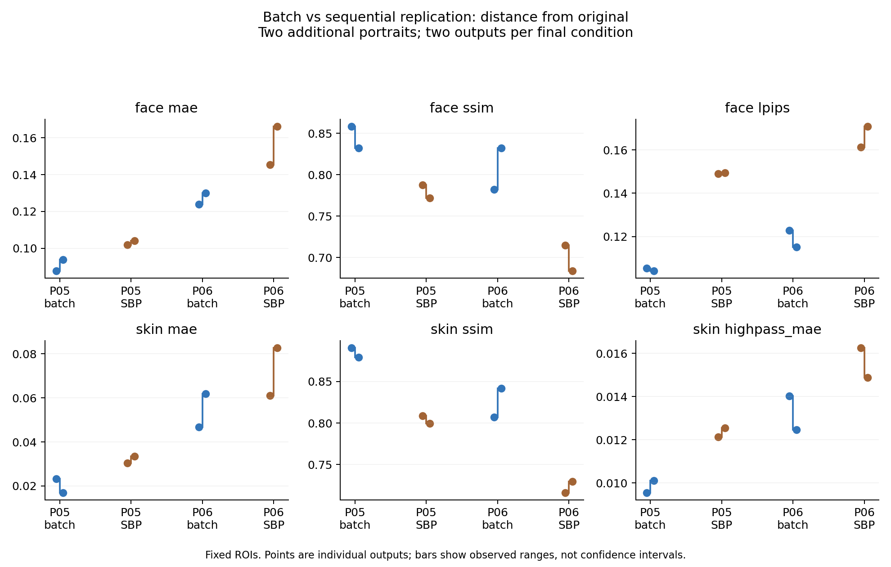

# 타 인물 일괄/순차 재현 — 16회 새 생성

2026-09-09. 기존 P05/P06 각각에서 일괄 1회와 S→B→P 순차 3회를 두 번 실행했다. **16/16 출력 저장, 재시도 0, 픽셀 기준 서로 다른 이미지 16장**이다.

두 인물 모두에서 일괄 편집 두 출력의 고정 얼굴 MAE·LPIPS가 순차 두 출력보다 낮고 SSIM은 높았다. 효과 크기는 인물마다 달랐다. 피부 지표 평균도 두 인물에서 일괄 편집이 원본에 더 가까웠지만, P06 피부 MAE의 개별 범위는 겹친다. 얼굴 사각형에는 배경·머리 등이 포함되므로 이 결과를 사람의 피부 열화 등급이나 동일성 보존 성공률로 바꾸지 않는다.

## 설계와 범위

[사전 계획](PROTOCOL.md) · [입력·프롬프트·고정 ROI](plan.json). 이전 P04 결과를 본 뒤 설계한 후속 연구이며 미관찰 인물 검증은 아니다. 두 기존 원본에서 각 경로를 새로 시작했다. S=셔츠 남색, B=옅은 파랑 배경, P=은색 핀. 순서는 최적 결과를 골라 정한 것이 아니라 첫 예비 실험의 SBP를 유지했다. 모든 최종 프롬프트는 같다. 생성 seed와 내부 모델 버전은 노출되지 않았다.

두 반복의 최초 출력을 전부 보존했다. 생성 담당자의 가시적 실행 점검에서는 최종 출력에 셔츠 색·배경·핀 요청이 반영됐으나 세부 색조·핀 크기까지 동일한 것은 아니다. 이는 비블라인드 점검이며 사람 평가 또는 독립 AI 등급이 아니다. 새 사람 평가·독립 AI 점수는 수집하지 않았다.

## 고정 ROI 결과

평균 [최소, 최대]. 범위는 두 출력의 관측 범위이며 신뢰구간이 아니다. 낮은 MAE·LPIPS·고주파 MAE, 높은 SSIM은 해당 영역이 원본에 가깝다는 뜻이다.

| 인물/조건 | 얼굴 MAE ↓ | 얼굴 SSIM ↑ | 얼굴 LPIPS ↓ | 피부 MAE ↓ | 피부 SSIM ↑ | 피부 고주파 MAE ↓ |
| --- | --- | --- | --- | --- | --- | --- |
| P05:final:batch | 0.090827 [0.087729, 0.093924] | 0.845270 [0.832238, 0.858301] | 0.104716 [0.104098, 0.105334] | 0.020121 [0.016972, 0.023271] | 0.884834 [0.879300, 0.890368] | 0.009833 [0.009550, 0.010116] |
| P05:final:SBP | 0.103035 [0.101880, 0.104190] | 0.779874 [0.771881, 0.787868] | 0.149267 [0.149091, 0.149443] | 0.032009 [0.030469, 0.033549] | 0.803961 [0.799431, 0.808492] | 0.012339 [0.012135, 0.012544] |
| P06:final:batch | 0.126944 [0.123951, 0.129936] | 0.807234 [0.782106, 0.832362] | 0.119000 [0.115221, 0.122778] | 0.054364 [0.046840, 0.061889] | 0.824370 [0.807193, 0.841546] | 0.013251 [0.012473, 0.014028] |
| P06:final:SBP | 0.155720 [0.145278, 0.166161] | 0.699269 [0.683726, 0.714813] | 0.166047 [0.161261, 0.170832] | 0.071859 [0.061063, 0.082655] | 0.723042 [0.716279, 0.729805] | 0.015563 [0.014873, 0.016252] |



[PDF](final-comparison.pdf) · [SVG](final-comparison.svg)

## 최종 출력별 값

| 출력 | 얼굴 MAE ↓ | 얼굴 SSIM ↑ | 얼굴 LPIPS ↓ | 피부 MAE ↓ | 피부 SSIM ↑ | 피부 고주파 MAE ↓ |
| --- | --- | --- | --- | --- | --- | --- |
| P06-batch-r1-s1 | 0.123951 | 0.782106 | 0.122778 | 0.046840 | 0.807193 | 0.014028 |
| P05-batch-r1-s1 | 0.087729 | 0.858301 | 0.105334 | 0.023271 | 0.890368 | 0.009550 |
| P06-SBP-r1-s3 | 0.145278 | 0.714813 | 0.161261 | 0.061063 | 0.716279 | 0.016252 |
| P05-SBP-r1-s3 | 0.101880 | 0.787868 | 0.149091 | 0.030469 | 0.808492 | 0.012135 |
| P05-batch-r2-s1 | 0.093924 | 0.832238 | 0.104098 | 0.016972 | 0.879300 | 0.010116 |
| P06-batch-r2-s1 | 0.129936 | 0.832362 | 0.115221 | 0.061889 | 0.841546 | 0.012473 |
| P06-SBP-r2-s3 | 0.166161 | 0.683726 | 0.170832 | 0.082655 | 0.729805 | 0.014873 |
| P05-SBP-r2-s3 | 0.104190 | 0.771881 | 0.149443 | 0.033549 | 0.799431 | 0.012544 |

## NCC sigma3 보조 결과

| 인물/조건 | 얼굴 MAE ↓ | 얼굴 SSIM ↑ | 얼굴 LPIPS ↓ | 피부 MAE ↓ | 피부 SSIM ↑ | 피부 고주파 MAE ↓ |
| --- | --- | --- | --- | --- | --- | --- |
| P05:final:batch | 0.096006 [0.092138, 0.099874] | 0.752856 [0.729644, 0.776068] | 0.112622 [0.111705, 0.113539] | 0.024923 [0.023019, 0.026827] | 0.787990 [0.774655, 0.801325] | 0.014079 [0.013718, 0.014440] |
| P05:final:SBP | 0.103423 [0.102040, 0.104806] | 0.758228 [0.747594, 0.768861] | 0.150512 [0.149701, 0.151324] | 0.034133 [0.032243, 0.036023] | 0.796461 [0.789650, 0.803271] | 0.013125 [0.012943, 0.013308] |
| P06:final:batch | 0.126533 [0.123130, 0.129936] | 0.812888 [0.793414, 0.832362] | 0.118744 [0.115221, 0.122268] | 0.053443 [0.044998, 0.061889] | 0.822222 [0.802898, 0.841546] | 0.013547 [0.012473, 0.014620] |
| P06:final:SBP | 0.151854 [0.141383, 0.162325] | 0.749757 [0.739979, 0.759536] | 0.156816 [0.154151, 0.159481] | 0.067134 [0.056092, 0.078176] | 0.755275 [0.748071, 0.762479] | 0.015457 [0.015225, 0.015689] |

sigma1/6과 모든 중간 단계·직전 입력 대비 지표는 [CSV](metrics.csv)와 [원시 결과](results.json)에 있다. NCC는 정수 이동만 보정하며 색·형태·질감 차이를 제거하지 않는다.

## 사전 포함한 피부 평균색 진단

| 인물/조건 | 피부 원시 MAE | 평균색 제거 잔차 MAE | MSE 평균색 항 비율 |
| --- | --- | --- | --- |
| P05:final:batch | 0.020121 | 0.011909 | 57.9% |
| P05:final:SBP | 0.032009 | 0.018445 | 58.8% |
| P06:final:batch | 0.054364 | 0.015838 | 87.1% |
| P06:final:SBP | 0.071859 | 0.023918 | 85.0% |

피부 영역별 출력−원본 차이 d를 평균색 b와 잔차 e=d−b로 나눴다. MSE=평균색 MSE+잔차 MSE를 검사했다. 두 인물 모두 평균색 제거 잔차 MAE도 일괄 편집 평균이 더 낮았다. 이 비율은 수학적 성분이며 조명 또는 열화의 인과적 비율이 아니다. MAE 항은 가산 분해가 아니다. [전체 결과](color-results.json).

## 검증과 재현

16개 입력 연결·첫 호출·파일 해시·1024×1536 크기와 완전성을 검사했다. 고정 얼굴 MAE/SSIM 원본·직전 32쌍을 별도로 재계산하고 CSV 640행 및 모든 집계값을 대조했다. 기존 LPIPS 전체 가중치 해시와 일치한다. [검증 기록](verification.json) · [환경·파일 해시](manifest.json).

```sh
.venv-metrics/bin/python experiments/edit-replication-v1/analyze.py
.venv-metrics/bin/python experiments/edit-replication-v1/verify.py
.venv-metrics/bin/python experiments/edit-replication-v1/color_diagnostic.py
.venv-metrics/bin/python experiments/edit-replication-v1/report.py
```

저장된 결과만 분석하며 새 생성이나 사람 응답을 만들지 않는다. P04 순서 연구와 모집단 표본처럼 합쳐 유의성을 계산하지 않았다. 이번 재현은 제한된 세 인물에서의 방향 일치에 근거를 더하지만 일반화, 자연스러움, 사람과 지표의 정합성은 검증하지 못한다.
