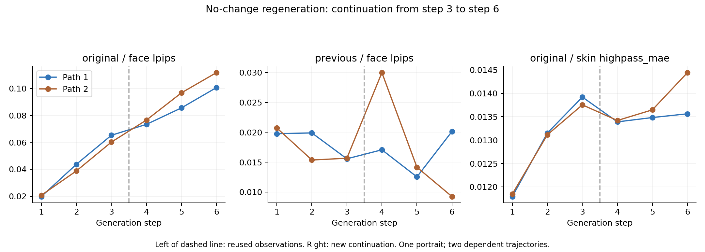

# 변경 없는 재생성 — 3→6단계 연장

2026-09-09. 기존 P04 두 경로를 그대로 6단계까지 연장했다. **새 호출6/6 저장, 재시도0**. 아래12개 단계 관측 중 앞6장은 [이전 연구](../edit-decomposition-v1/RESULTS.md)의 재사용이고 뒤6장만 새 결과다. 독립 경로는 여전히2개다.

## 설계

[새 호출 전에 고정한 계획](PROTOCOL.md) · [프롬프트·입력 연결](plan.json). 모든 단계에서 같은 '아무 변경 없이 충실하게 재현' 프롬프트를 사용하고 직전 출력을 입력했다. 1~3단계 증가를 본 뒤 연장을 결정했으므로 사후 선택된 후속 관찰이다. 6단계에서 중단하는 상한을 새 출력 전에 정했다. 좋은 결과를 골라 교체하지 않았다.

## 원본 거리와 직전 거리

| 단계 | 원본 얼굴 LPIPS 평균 | 직전 얼굴 LPIPS 평균 | 원본 피부 MAE 평균 |
| --- | --- | --- | --- |
| 1 | 0.020250 | 0.020250 | 0.015849 |
| 2 | 0.041245 | 0.017633 | 0.022593 |
| 3 | 0.062738 | 0.015616 | 0.028938 |
| 4 | 0.074960 | 0.023536 | 0.030370 |
| 5 | 0.091194 | 0.013351 | 0.033046 |
| 6 | 0.106249 | 0.014696 | 0.036846 |



[PDF](trajectory.pdf) · [SVG](trajectory.svg)

직전 입력과의 거리가 작아지는 것과 원본으로 돌아가는 것은 다르다. 단계별 차이를 단순히 더해서 원본 LPIPS를 계산할 수도 없다. 반복 간 차이와 전체 궤적을 함께 해석해야 하며, 여섯 단계만으로 장기 포화·수렴을 주장하지 않는다.

## 모든 관측값

| 반복 | 단계 | 원본 MAE | 원본 SSIM | 원본 LPIPS | 직전 LPIPS | 피부 MAE | 피부 SSIM | 피부 고주파 MAE |
| --- | --- | --- | --- | --- | --- | --- | --- | --- |
| 1 | 1 | 0.017823 | 0.905976 | 0.019771 | 0.019771 | 0.015756 | 0.849939 | 0.011794 |
| 1 | 2 | 0.030415 | 0.851030 | 0.043718 | 0.019900 | 0.023984 | 0.811995 | 0.013151 |
| 1 | 3 | 0.038016 | 0.828726 | 0.065270 | 0.015568 | 0.032962 | 0.783320 | 0.013920 |
| 1 | 4 | 0.038375 | 0.829521 | 0.073373 | 0.017076 | 0.032231 | 0.786816 | 0.013390 |
| 1 | 5 | 0.040461 | 0.814348 | 0.085599 | 0.012539 | 0.033408 | 0.778687 | 0.013482 |
| 1 | 6 | 0.043509 | 0.793560 | 0.100689 | 0.020140 | 0.037264 | 0.773184 | 0.013562 |
| 2 | 1 | 0.016584 | 0.896220 | 0.020728 | 0.020728 | 0.015942 | 0.849402 | 0.011848 |
| 2 | 2 | 0.024948 | 0.837611 | 0.038773 | 0.015365 | 0.021202 | 0.819599 | 0.013114 |
| 2 | 3 | 0.034768 | 0.784794 | 0.060205 | 0.015664 | 0.024914 | 0.800105 | 0.013753 |
| 2 | 4 | 0.038200 | 0.758645 | 0.076547 | 0.029996 | 0.028509 | 0.788298 | 0.013419 |
| 2 | 5 | 0.043092 | 0.743473 | 0.096789 | 0.014162 | 0.032684 | 0.776343 | 0.013647 |
| 2 | 6 | 0.048303 | 0.715660 | 0.111808 | 0.009252 | 0.036428 | 0.746316 | 0.014443 |

[trajectory.json](trajectory.json)에 기존 단계의 출처와 전체 지표를 연결했다. 새 단계의 원본/직전 얼굴·피부 지표 및 고정/NCCsigma1/3/6은 [results.json](results.json)과 [CSV](metrics.csv)에 있다. 기존1~3단계의 피부 분석은 원본 기준만 있으므로 직전 피부 값을 새로 지어 채우지 않았다. 원본 얼굴 거리의 엄격한 단계별 단조성 검사는 {"1": {"mae": true, "ssim": false, "lpips": true}, "2": {"mae": true, "ssim": true, "lpips": true}} 이다. SSIM은 감소 방향으로 검사했다.

## 검증

새6장의 크기·입력 연결·시간 순서·원본/이전 결과 해시를 확인했다. 원본/직전 고정 MAE/SSIM12쌍 별도 재계산, CSV240행, 모든 집계값을 대조했다. LPIPS 가중치는 기존과 같다. [검증](verification.json) · [환경·해시](manifest.json) · [새6장의 평균색/잔차 진단](color-results.json).

```sh
.venv-metrics/bin/python experiments/nochange-extension-v1/analyze.py
.venv-metrics/bin/python experiments/nochange-extension-v1/verify.py
.venv-metrics/bin/python experiments/nochange-extension-v1/color_diagnostic.py
.venv-metrics/bin/python experiments/nochange-extension-v1/report.py
```

저장된 출력을 읽는 분석이며 생성하지 않는다. 관측값은 원본과의 수치적 차이로서 사람의 피부 열화·자연스러움·동일성 정답이 아니다. 기존 경로를 연장한 한 인물 결과이므로 인물 일반화나 모델 일반화를 주장하지 않는다.
