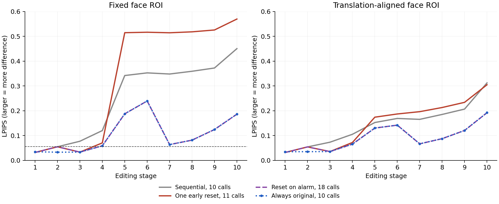

# 얼굴 외 요소의 순차 편집에서 얼굴 변화 지표와 원본 기반 재생성

합성 인물 6명의 10단계 편집과 원본 기반 재생성을 비교했다.

## 결론

원본 기반 최종 6개는 두 AI 세션 모두 피부 변화 없음 또는 약함으로, 순차 최종 6개는 모두 심함으로 평가했다. 위치를 보정한 얼굴 MAE·SSIM·LPIPS는 최종 6쌍 모두 원본 기반 방식에 유리했다. 얼굴 변화량은 연속 지표로, 인위적인 피부 무늬와 변형은 AI 등급으로 분석했다.

## 자료와 비교 방법

- 합성 인물 원본 6개에 같은 10단계 편집을 한 번씩 적용해 순차 경로 6개를 구성했다.
- 현재 요구는 귀걸이→목걸이→핀→의상→배경 추가 후 핀 색·펜던트 모양·재킷 색·셔츠 색·배경을 수정하는 10단계다. 얼굴·표정·자세·인물 조명은 유지하도록 요청했다.
- 순차 편집은 직전 출력에 갱신된 전체 요구를 입력한다. 재생성은 최초 원본에 같은 시점의 전체 요구를 적용한다. 변경된 속성은 최신 상태로 대체한다.
- 신규 생성 계획 27회 중 25회 성공했다. P05 단일 개입 경로는 9단계 도구 차단으로 종료해 9·10단계 결과를 결측 처리했다. 각 호출의 첫 성공 결과를 사용했다.
- 기존 자료를 포함한 18정책 경로에서 178개 단계별 확정 출력을 관측했다. 17개 경로가 10단계까지 완결됐고 고유 최종 이미지는 15개다. 경로 내 단계와 정책 간 공유 출력은 종속된 관측값이다.
- 수치 진단은 고유 103개 출력, 얼굴 AI 관찰은 단계별 확정 출력 고유 101개다. 나머지 2개는 교체 단계의 개입 전 후보로 수치 진단에만 포함된다.

원문 설계는 [PROTOCOL.md](./PROTOCOL.md), 평가 구체화와 실패 처리는 [EXTENSION_EVALUATION.md](./EXTENSION_EVALUATION.md), 실제 입력·프롬프트·출력은 [generation](./generation/)에 보존했다.

## 1. 얼굴 지표와 AI 등급의 관계

두 얼굴 평가 세션에 원본과 결과의 320×360 얼굴 영역을 제공하고 방법·단계·지표·이전 판단을 가렸다. 새로 생긴 인위적인 피부 무늬와 형태 왜곡을 없음 0, 약함 1, 뚜렷함 2, 심함 3으로 평가했다. 조명·색조·배치 변화는 별도 항목으로 기록했다.

같은 기반 모델의 두 세션이 각각 121항목(고유 101 + 원본 대조 10 + 숨긴 반복 10)을 관찰했다. 고유 101개 등급 일치는 91/101(90.10%), 뚜렷함 이상 여부 일치는 98/101(97.03%)다. 선형 가중 κ는 0.907661이다. 원본 대조는 양쪽 모두 10/10에서 없음이었고, 숨긴 반복의 등급 일치는 A 9/10, B 10/10이었다. 이 수치는 동일 모델의 세션 간 평가 일관성을 나타낸다.

초기 평가 묶음의 고유 73개 출력에서 AI 등급과 고정 MAE·1−SSIM·LPIPS의 Spearman rho는 A에서 0.611/0.743/0.738, B에서 0.608/0.739/0.728이었다. sigma3 위치 보정 LPIPS의 rho는 A 0.812, B 0.803이었다. 지표는 연속값으로 비교했다.

인물별 순차 최종과 종료 시 일괄 재생성 6쌍에서 고정 MAE·SSIM·LPIPS는 각각 5/6, 위치 보정 세 지표는 모두 6/6에서 순차 편집의 원본 차이가 더 컸다.

## 2. 최종 얼굴 지표와 피부 등급

순차 최종 6개는 두 얼굴 세션 모두 심함3으로 평가했다. 원본 기반 최종 6개는 두 세션 모두 없음0 또는 약함1이었다.

| 원본 | 순차 최종 고정 LPIPS | 원본 기반 최종 고정 LPIPS | 원본 기반 최종 피부 등급 A/B |
|---|---:|---:|---:|
| P01 | 0.270484 | 0.276156 | 1 / 0 |
| P02 | 0.266629 | 0.115309 | 1 / 1 |
| P03 | 0.415614 | 0.252317 | 1 / 1 |
| P04 | 0.450226 | 0.186177 | 0 / 0 |
| P05 | 0.531565 | 0.235683 | 1 / 1 |
| P06 | 0.383100 | 0.310005 | 1 / 1 |

원본 기반 결과에는 원본과의 수치 차이가 남았지만 AI 피부 등급은 0~1이었다. 연속 지표는 위치·색·구조 변화까지 반영하므로 피부 등급과 함께 해석한다. 초기 탐색 임계값을 적용한 결과는 [signal-transfer.json](./joined-reviews/signal-transfer.json)에 있다.

## 3. 중간 재생성 이후의 변화

초기 P01에서 정한 탐색용 LPIPS 임계값으로 첫 재생성 시점을 선택하고, 이후에는 순차 편집을 이어갔다.

| 원본 | 최초 재생성 단계 | 재생성 직후 LPIPS | 다음 경보 단계 / LPIPS | 재생성 이후 AI 첫 뚜렷함 A/B |
|---|---:|---:|---:|---:|
| P04 | 3 | 0.033253 | 4 / 0.070391 | 5 / 4 |
| P05 | 2 | 0.042525 | 3 / 0.067081 | 3 / 3 |
| P06 | 2 | 0.048793 | 3 / 0.073938 | 4 / 4 |

세 경로 모두 재생성 직후 LPIPS가 임계값 아래로 내려갔고, 다음 편집에서 다시 임계값을 넘었다. AI가 피부 변화를 뚜렷하다고 평가한 최초 단계는 표에 별도로 제시했다.

완결된 P04 단일 개입 경로의 최종 피부 등급은 A2/B3, P06은 A3/B3이었다. P05는 9단계 생성 실패로 8단계까지 관측했으며, 10단계 최종값과 경로 평균은 결측 처리했다.

## 4. P04 정책별 호출 수와 얼굴 지표

P04 한 원본에서 정책을 비교했다. 호출 수는 10단계 작업에 필요한 논리적 이미지 생성 횟수다.

| 정책 | 호출 수 | 평균 고정 LPIPS | 평균 정합 LPIPS | 피부 뚜렷함 이상 단계 A/B |
|---|---:|---:|---:|---:|
| 순차 유지 | 10 | 0.250733 | 0.145487 | 8 / 9 |
| 최초 경보 때만 재생성 | 11 | 0.334774 | 0.150213 | 6 / 8 |
| 3단계마다 재생성 | 13 | 0.178503 | 0.115825 | 4 / 6 |
| 경보 때마다 재생성 | 18 | 0.106101 | 0.092580 | 0 / 1 |
| 마지막에만 재생성 | 11 | 0.224328 | 0.133484 | 7 / 8 |
| 매 단계 원본에서 생성 | 10 | 0.104210 | 0.090963 | 0 / 0 |

경보 정책은 3~10단계에 매번 재생성했다. 매 단계 원본 방식과 입력·프롬프트가 같아 해당 8개 저장 출력을 공유한다. 같은 최종 이미지에 도달하는 데 매 단계 원본 방식은 10회, 경보 정책은 18회가 필요했다. 이 비교는 요구사항을 미리 정한 P04 작업에서의 호출 구조를 보여준다.

최종 요구를 처음부터 적용하면 원본 기반 최종 이미지에 1회가 필요하고, 순차 10회 후 마지막에 재생성하면 총 11회가 필요하다. 중간 결과의 검토 여부에 따라 작업 비용을 구분한다.

P04 경보 정책의 9단계 재생성은 직전 후보보다 고정 및 세 정합 설정의 얼굴·피부 지표에서 모두 원본과 멀어졌다. 세부 수치는 [metrics/RESULTS.md](./metrics/RESULTS.md), 전체 정책 곡선·비용은 [extension-metrics/RESULTS.md](./extension-metrics/RESULTS.md)에 있다.

## 5. 편집 요구 충족도

얼굴 평가와 별도의 두 세션이 고유 최종 후보 15개를 원본과 비교했다. 귀걸이, 목걸이/물방울 펜던트, 파란 핀/위치, 차콜 재킷, 버건디 라운드넥, 나무 책장 도서관, 글자·로고·워터마크 없음의 7조건은 두 세션 모두 15/15 충족으로 평가했다.

인물 조명 유지는7개 충족,8개 일부 충족이었다. 일부 충족8개는 순차 최종6개와 단일 초기 개입 최종2개다. 원본 기반 최종6개와 P04 고정 간격 최종1개는 조명까지8개 조건을 충족한 것으로 관찰됐다. 조건별120개 판단은 두 세션이 일치했다. 전체 이미지의 인위성은 별도로 기록했고, P02 원본 기반 최종에서 없음/약함으로 나뉘었다.

평가 범위는 장신구·의상·배경과 인물 조명이다. AI 요구 평가 원문은 [joined-reviews/requirements.json](./joined-reviews/requirements.json)에 있다.

## 6. 선행 연구와 적용 범위

본 연구는 합성 인물의 장신구·의상·배경 편집에서 입력 이미지 선택과 호출 정책을 비교한다. 원본 참조와 다중 편집 평가는 [Multi-turn Consistent Image Editing](https://arxiv.org/html/2505.04320), [EdiVal-Agent](https://arxiv.org/html/2509.13399)와 관련된다. 지각 거리와 보존 영역 평가는 [LPIPS](https://arxiv.org/html/1801.03924), [GIE-Bench](https://arxiv.org/html/2505.11493)를 참고했다.

초기 생성기의 재현 범위는 보존된 입력·출력·프롬프트와 분석 기록이다. AI 등급은 동일 기반 모델의 두 세션을 사용했다. 문헌별 비교는 [SOURCE_REVIEW.md](./literature/SOURCE_REVIEW.md)에 있다.
