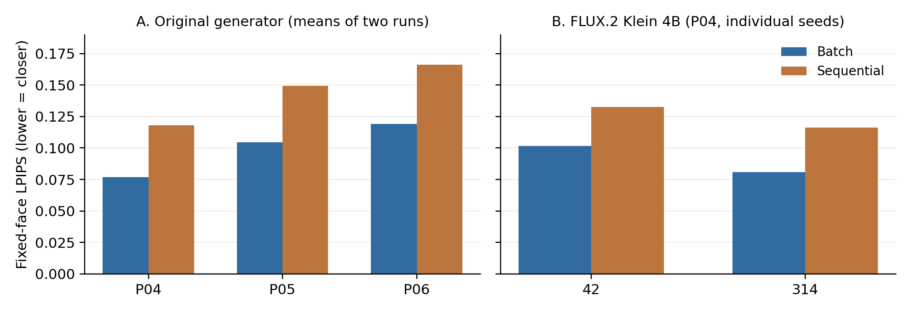

# 반복 이미지 편집에서의 얼굴 보존과 원본 기반 재생성 비교

A Comparison of Facial Preservation and Original-Referenced Regeneration in Iterative Image Editing

저자: 김미르, 장윤석 (________________, ________________)

지도교수: 안남혁

## 초록
이미지 편집 시스템에서 앞선 생성물을 다음 입력으로 사용하면 요청하지 않은 얼굴 변화가 누적될 수 있다. 본 연구는 순차 편집과 최초 원본에 누적 요구사항을 적용하는 재생성을 비교한다. 초기 실험은 합성 인물 6명과 순차 7경로, 후속 통제 실험은 기존 3인물의 98개 출력을 포함한다. 얼굴 MAE·SSIM·LPIPS, 피부 내부 영역 및 별도 AI 등급으로 분석하였다. 세 인물의 후속 비교에서 일괄 편집의 평균 얼굴 LPIPS가 순차보다 낮았다. 별도 FLUX.2 Klein 4B 실험의 두 시드 평균 LPIPS는 일괄 0.091313, 순차 0.124455였으나 피부 원시 MAE는 일부 설정에서 반대 방향이었다. 최초 원본과 누적 요구를 분리하는 웹 편집기를 구현하였다. 웹 생성 경로를 합성 인물 6명·3시드로 확장한 18쌍에서 평균 얼굴 LPIPS는 일괄 0.087120, 순차 0.108710이었으며, 일괄 방식이 18쌍 모두 낮았다. 실험 결과는 원본 기반 입력 정책의 효과가 측정 영역과 지표에 따라 달라짐을 보여주며, 누적 요구사항을 관리하는 편집기의 구현 근거를 제공한다.

주요어: 순차 이미지 편집, 얼굴 보존, 원본 기반 재생성, 지각 유사도, 탐색적 평가

## Abstract

We compare sequential image editing with regeneration from the original image and accumulated requirements. Experiments include six synthetic identities, 98 follow-up outputs from three identities, automatic image metrics and separate AI ratings. Batch editing produced lower mean facial LPIPS in the tested follow-up comparisons. A local FLUX.2 Klein 4B comparison yielded mean LPIPS of 0.091313 for batch and 0.124455 for sequential editing, while raw skin MAE reversed the ranking in some settings. A web editor implemented the workflow. In a six-identity, three-seed website-path comparison, mean facial LPIPS was 0.087120 for batch and 0.108710 for sequential editing across 18 pairs. The findings characterize the dependence of input-policy effects on measurement regions and support an editor that maintains accumulated editing requirements.

## 1. 서론
인물 이미지 편집에서는 셔츠, 배경, 장신구를 변경하면서 얼굴을 유지하는 것이 주요 요구사항이다. 생성형 편집 과정에서 얼굴의 색조, 질감, 윤곽과 세부가 함께 변할 수 있으므로 요청한 요소의 변경과 얼굴 보존을 각각 평가할 필요가 있다.

다중 턴 이미지 편집과 내용 보존은 기존 연구에서도 다뤄진 문제다[1–3]. 본 연구는 생성기에 전달하는 입력 정책을 중심으로 입력 전달 방식, 측정 영역, 자동 지표, AI 판정 사이에 어떤 차이가 나타나는지 확인한다. 특히 색과 위치의 변화가 포함된 원본 거리를 피부 열화의 직접 측정값으로 취급할 때 발생하는 해석 문제에 초점을 둔다.

연구 질문은 다음과 같다. 첫째, 이전 결과를 입력으로 쓰는 순차 편집과 최초 원본을 참조하는 생성은 얼굴 원본 거리에서 어떤 차이를 보이는가? 둘째, 그 차이는 편집 순서, 무변경 반복, 측정 영역 및 위치 보정에 따라 유지되는가? 셋째, 얼굴 전체 거리와 피부 내부 지표의 비교 방향은 일치하는가? 넷째, 관찰된 결과를 사용자의 연속 요청을 처리하는 시스템 설계에 어떻게 반영할 수 있는가?

본 연구의 기여는 세 가지다. 입력 정책과 후속 통제 실험을 연결한 탐색적 기록을 제시하고, 거리·열화·보존·요청 이행을 분리하여 결과를 해석하며, 피부 내부 영역의 민감도 분석을 제공한다. 표본 규모와 생성 조건에는 제한이 있으므로 결과는 가설 형성 및 후속 실험 설계의 근거로 사용한다.

## 2. 관련 연구
MagicBrush는 단일 턴과 다중 턴을 포함하는 사람 주석 기반 이미지 편집 데이터셋을 제시한다[1]. 이는 편집 성능을 한 번의 결과만으로 평가하기 어렵다는 배경을 제공한다. Multi-turn Consistent Image Editing은 다중 턴에서의 누적 오차와 내용 일관성을 모델 수준에서 다룬다[2]. 본 연구는 사용 가능한 생성기에서 직전 출력과 최초 원본을 참조하는 두 입력 정책을 비교한다.

GIE-Bench는 지시 이행과 보존 평가를 구분하며[4], EdiVal-Agent는 지시 이행, 내용 일관성, 시각 품질을 다차원으로 평가한다[3]. 본 연구도 원본과의 수치적 거리, AI 열화 등급, 편집 요구의 이행을 별도 항목으로 다룬다.

SSIM은 구조적 유사도를, LPIPS는 학습된 특징 공간의 지각적 거리를 측정한다[5,6]. 본 연구에서는 이들을 원본과 출력의 차이를 정량화하는 지표로 사용한다. MAE는 색 이동과 기하학적 어긋남에도 반응한다. 이에 따라 얼굴 사각형뿐 아니라 피부 내부 영역, 위치 보정, 평균 색 제거 분석을 함께 사용한다.

## 3. 연구 설계
### 3.1 자료 범위와 분석 단위
인물 P01–P06은 합성 이미지다. 초기 순차 편집은 6명에 대해 7경로를 구성하며 P03에 두 경로가 있다. 정책 비교는 20경로의 198단계 출력을 포함한다. 경로 간 공유 출력과 동일 인물의 반복 관측을 구분하고, 미완료 단계는 결측으로 처리하였다. 분석별 자료 범위는 표 1에 제시하였다.

| 실험 묶음 | 생성·분석 범위 | AI 평가 범위 |
| --- | --- | --- |
| 초기 10단계 및 정책 비교 | 6인물, 순차 7경로; 수치 분석 고유 113개 | AI 고유 111개·두 세션 |
| 후속 편집 통제 | 기존 3인물, 예비 14개와 추가 84개, 총 98개 | 선정 최종 12개에 별도 AI 1세션 |
| 로컬 FLUX 정책 비교 | P04, 2시드, 새 출력 8개·최종 4개 | 자동 지표 분석 |
| 로컬 ROI 민감도 분석 | 위 8개 재분석, 최종 4개 별도 집계 | 기존 출력의 지표 재분석 |
| 웹 편집기 정책 비교 | P04 예비 2시드·8개 출력; 6인물 확장 3시드·72개 출력 | 자동 지표 분석 |

초기 수치 분석은 확정 출력 111개와 개입 전 후보 2개를 포함하며, AI 평가는 확정 출력을 대상으로 하였다. 후속 AI 평가에는 98개 중 최종 출력 12개를 선정하였다. 원본 대조와 개발용 이미지는 검증용 자료로 별도 관리하였다. 초기 생성기는 도구 기반 이미지 생성 시스템이며 정확한 백엔드 모델 버전과 시드는 확보되지 않았다. 따라서 이 부분의 재현성은 보존된 입력·출력·프롬프트·분석 기록에 한정된다.

### 3.2 입력 정책과 편집 과제
초기 10단계 과제는 귀걸이, 목걸이, 핀, 의상, 배경 등의 비얼굴 편집 및 후속 색·형태 변경으로 구성된다. 순차 정책은 직전 출력을 다음 입력으로 사용한다. 원본 기반 정책은 최초 입력에 해당 시점까지의 요구사항을 적용한다. 중간 1회 개입, 3단계마다 개입, 알람 기반 개입, 마지막 단계만 재생성하는 변형도 기록하였다. 공유 출력이 있는 정책은 입력 경로와 호출 수를 비교하였다.

후속 실험에서는 셔츠, 배경, 핀의 최종 요구를 한 번에 적용하는 일괄 방식과 세 단계로 적용하는 순차 방식을 비교하였다. 동일한 최종 요구를 기준으로 최종 이미지의 지표와 각 작업 흐름의 호출 수를 비교하였다.

98개 후속 출력은 예비 분해 실험 14개, 편집 순서 실험 38개, P05·P06 재현 16개, 색·재질 요인 실험 24개, 무변경 반복 연장 6개로 구성된다. 순서 실험은 세 편집의 여섯 순열을 포함한다. 무변경 반복은 요청 내용이 추가되지 않아도 생성 반복 자체가 변화를 유발하는지 확인하는 대조다.

### 3.3 자동 지표와 영역
RGB를 [0,1] 범위로 정규화하여 원본과 출력 사이의 MAE를 계산한다. 얼굴 영역의 SSIM과 LPIPS(AlexNet, version 0.1)를 함께 보고하며 MAE·LPIPS는 낮을수록, SSIM은 높을수록 원본에 가깝다. 각 지표의 연속값과 방법 간 차이를 분석한다. 얼굴 사각형에는 피부 외에 눈·머리카락 및 주변 내용이 포함될 수 있으므로 피부 내부 영역 분석을 별도로 수행한다.

위치 민감도 분석은 정규화 상호상관(NCC)을 이용한 정수 픽셀 평행이동으로 수행한다. 고해상도 후속 분석의 Gaussian sigma는 1, 3, 6이며 로컬 절반 해상도에서는 0.5, 1.5, 3을 사용한다. 원래 픽셀을 유지한 채 대응 위치의 영역을 잘라 비교하며, 보정 범위는 평행이동으로 한정한다.

피부 영역에는 원시 RGB MAE, SSIM, 고주파 성분 MAE 및 평균 RGB 제거 후 잔차 MAE를 사용한다. 픽셀 차이 d의 평균을 μ라 할 때 MSE는 mean(d²) = μ² + mean((d−μ)²)로 분해된다. 채널별 계산 후 평균하며, 이 항등식은 수치적으로 검산한다. 이 분해는 MSE에 적용하며, 평균 색 차이와 그 외 잔차의 크기를 정량화한다.

### 3.4 AI 평가
AI 열화 등급은 없음(0), 약함(1), 뚜렷함(2), 심함(3)이다. 초기 AI 평가는 같은 기반 모델의 두 세션이 고유 111개 출력을 평가한 것이다. 원본 대조 10개와 숨은 반복 12개를 세션별로 추가하였다. 후속 평가는 별도 세션에서 익명 최종 후보 12개와 원본 대조 3개를 평가하였다.  세션 간 일치율로 동일 모델의 평가 일관성을 분석하였다.

### 3.5 로컬 모델과 재현성
로컬 비교는 FLUX.2 Klein 4B의 4비트 양자화 가중치와 MFLUX 0.19.1을 사용하였다[7,8]. 실행 환경은 Apple M1, 메모리 16 GB이며, 추론은 4스텝으로 설정하였다. P04 원본을 두 방법 모두 동일하게 512×768로 축소하고 시드 42와 314를 사용하였다. 각 순차 경로에서는 같은 시드를 유지하고, 반복 간 방법 실행 순서를 반대로 하였다. 각 호출의 첫 출력을 분석에 사용하였다.

로컬 영역 민감도 분석은 고정 얼굴 결과를 확인한 후 설계한 사후 분석이다. 모든 보정 설정을 인물과 시드별 기술 통계로 비교하였다.

## 4. 결과
### 4.1 초기 순차 경로와 원본 기반 정책
P04의 10단계 경로 평균 LPIPS와 논리적 생성 호출 수를 표 2에 정리하였다. 호출 수는 각 정책에 필요한 이미지 생성 횟수이다. 알람 방식은 원본 기반 방식과 확인된 출력 8개를 공유한다. 알람 조건에는 초기 실험에서 정한 탐색적 규칙을 사용하였다.

| 정책 | 호출 수 | 고정 얼굴 평균 LPIPS | 위치 보정 평균 LPIPS |
| --- | ---: | ---: | ---: |
| 순차 | 10 | 0.250733 | 0.145487 |
| 중간 1회 개입 | 11 | 0.334774 | 0.150213 |
| 3단계마다 개입 | 13 | 0.178503 | 0.115825 |
| 알람 기반 개입 | 18 | 0.106101 | 0.092580 |
| 마지막만 재생성 | 11 | 0.224328 | 0.133484 |
| 매 단계 원본 기반 | 10 | 0.104210 | 0.090963 |

일곱 대응 최종 비교에서 고정 영역 지표는 각 지표별 6/7이 원본 기반에 유리했고 위치 보정 후에는 7/7이었다. P01의 고정 LPIPS는 순차 0.270484, 원본 기반 0.276156으로 반대 사례였다. 원본 기반 방식의 이득은 인물과 위치 보정 조건에 따라 차이를 보였다.

### 4.2 후속 통제 실험
세 인물의 후속 비교에서 일괄 방식의 평균 얼굴 LPIPS가 순차 방식보다 낮았다. P04 값은 편집 순서 실험의 일괄 및 셔츠→배경→핀 경로를 기준으로 하였다.

| 인물 | 일괄 LPIPS | 순차 LPIPS | 반복 수/방법 |
| --- | ---: | ---: | ---: |
| P04 | 0.076800 | 0.118081 | 2 |
| P05 | 0.104716 | 0.149267 | 2 |
| P06 | 0.119000 | 0.166047 | 2 |

편집 순서의 상대적 성능은 지표와 반복에 따라 달랐으며, 색·재질 조건에 따른 얼굴 변화도 비단조적인 양상을 보였다. P06의 원래 재질 조건에서도 요청하지 않은 흰 줄무늬가 생성된 사례가 있어, 비목표 얼굴 보존과 편집 요구의 정확한 이행을 별도 검사할 필요가 있다.

무변경 반복 두 경로의 평균 얼굴 LPIPS는 1단계 0.020250에서 3단계 0.062738, 6단계 0.106249로 증가하였다. 고정 MAE와 LPIPS는 두 경로 모두에서 단조 증가하였다. 이는 명시적인 추가 편집 없이도 반복 생성이 원본과의 차이를 누적시킬 수 있음을 보여준다.

피부 분석은 얼굴 전체 수치의 해석을 제한한다. P04 단일 배경 편집의 피부 MAE는 0.049207로 셔츠 0.015323과 핀 0.014845보다 컸다. 그러나 배경 조건에서 피부 MSE의 87.8%는 평균 RGB 차이 성분이었으며, 평균 색 제거 후 MAE는 배경 0.014057, 셔츠 0.013909로 가까워졌다. 이는 피부 원시 오차에 평균 색 이동이 크게 반영됨을 보여준다.

### 4.3 AI 등급
후속 12개 이미지의 별도 AI 평가는 일괄 결과에서 약함 6개, 순차 결과에서 뚜렷함 2개와 심함 4개였다. 원본 대조 3개는 모두 0점이었다. 평가 대상은 세 인물에 대해 방법별로 두 번 생성한 최종 출력이다.

| 평가 항목 | 일괄 6개 | 순차 6개 |
| --- | --- | --- |
| AI 열화 | 약함 6 | 뚜렷함 2, 심함 4 |

초기 AI 두 세션의 정확 일치율은 89.19%, 선형 가중 κ는 0.897이었다.

### 4.4 로컬 FLUX 비교
로컬 모델의 두 시드에서 고정 얼굴 MAE·SSIM·LPIPS는 모두 일괄 방식에 유리하였다. 최종 요구는 남색 셔츠, 연한 파란 배경, 화면 기준 오른쪽의 은색 핀 하나였다. 실행 점검에서 네 결과 모두에 주요 편집 요소가 관찰되었다.

| 시드·방법 | 얼굴 MAE | 얼굴 SSIM | 얼굴 LPIPS |
| --- | ---: | ---: | ---: |
| 42 일괄 | 0.136402 | 0.812108 | 0.101721 |
| 42 순차 | 0.137721 | 0.703040 | 0.132763 |
| 314 일괄 | 0.133931 | 0.831322 | 0.080904 |
| 314 순차 | 0.142639 | 0.731237 | 0.116147 |
| 일괄 평균 | 0.135166 | 0.821715 | 0.091313 |
| 순차 평균 | 0.140180 | 0.717138 | 0.124455 |

평균 LPIPS는 일괄이 순차보다 26.6% 낮았다. 두 시드의 평균 총 생성 시간은 일괄 92.8초, 순차 261.2초였다. 각 값은 동일한 최종 요구를 일괄 1회 또는 순차 3회의 호출로 처리한 작업 시간이다.

### 4.5 영역과 위치 보정에 따른 차이
로컬 얼굴 ROI는 [176,44,336,224]이며 피부 영역은 이마 [226,72,284,89], 화면 왼쪽 볼 [206,132,224,153], 오른쪽 볼 [286,132,302,153]이다. 피부 좌표는 기존 고해상도 P04 영역의 정확한 절반이다. NCC 탐색 범위는 ±32픽셀로 설정했다.

| 설정·방법 | 얼굴 LPIPS | 피부 MAE | 피부 SSIM | 피부 고주파 MAE | 피부 잔차 MAE |
| --- | ---: | ---: | ---: | ---: | ---: |
| 고정·일괄 | 0.091313 | 0.063146 | 0.789313 | 0.011295 | 0.027721 |
| 고정·순차 | 0.124455 | 0.062319 | 0.668437 | 0.015116 | 0.039894 |
| σ=0.5·일괄 | 0.091313 | 0.063146 | 0.789313 | 0.011295 | 0.027721 |
| σ=0.5·순차 | 0.123278 | 0.063252 | 0.660936 | 0.015450 | 0.039787 |
| σ=1.5·일괄 | 0.091313 | 0.063146 | 0.789313 | 0.011295 | 0.027721 |
| σ=1.5·순차 | 0.123278 | 0.063252 | 0.660936 | 0.015450 | 0.039787 |
| σ=3·일괄 | 0.095030 | 0.064985 | 0.763278 | 0.012218 | 0.027467 |
| σ=3·순차 | 0.126023 | 0.060812 | 0.654603 | 0.015549 | 0.038189 |

표는 두 시드의 평균이다. 얼굴 LPIPS와 SSIM, 피부 SSIM·고주파 MAE·잔차 MAE의 평균 방향은 모든 설정에서 일괄에 유리했다. 반면 피부 원시 MAE는 고정과 σ=3에서 순차가 더 낮았고, σ=0.5 및 1.5에서는 두 방법이 매우 가까웠다. 시드 42의 피부 MAE는 모든 설정에서 순차가 더 낮았다. 피부 색 차이와 세부 구조 지표에서 비교 방향이 달라, 두 특성을 함께 고려할 필요가 있다.

## 5. 시스템 설계로의 적용
관찰 결과를 바탕으로 최초 원본과 누적 편집 상태를 별도로 저장하는 로컬 편집기를 구현하였다. 사용자의 새 요청은 현재 상태에 대한 변경으로 해석하고, 생성 방식은 일괄 재생성과 순차 생성 중 선택한다. 일괄 재생성은 최초 원본과 갱신된 전체 요구를 사용하고, 순차 생성은 현재 선택한 버전과 전체 요구를 사용한다.  첫 순차 생성은 최초 원본에서 시작한다. 이전 출력은 버전 이력으로 관리하며, 과거 버전을 선택한 후 순차 생성하면 선택한 이미지에서 새 경로를 시작한다.

지원 범위는 셔츠 색, 배경, 원형 핀이다. 상태와 이미지 버전을 함께 보존하여 되돌리기를 지원한다. 요청 해석은 정해진 동작 처리와 Qwen3 4B의 구조화 출력 보조로 구성하고, 모호한 취소·이전 시점 요청에는 버전 선택을 안내한다. 메모리 사용량을 줄이기 위해 언어 모델과 이미지 모델을 순차 실행한다.

### 5.1 웹 편집기의 입력 정책 비교

웹 화면과 동일한 HTTP 생성 경로에서 두 모드를 비교하였다. P04 원본, 시드 42·314, 512×768 해상도와 4스텝을 사용하고 남색 셔츠→옅은 파란 배경→은색 핀 순서로 요청하였다. 순차 방식은 각 요청 후 직전 출력을 입력으로 생성하고, 일괄 방식은 세 요청을 모은 뒤 최초 원본에서 한 번 생성하였다. 시드별 실행 순서를 반대로 하였으며 총 8개 출력 중 최종 4개를 비교하였다.

최종 상태와 프롬프트는 두 방식에서 같았다. 입력 스냅샷의 해시로 일괄 입력이 최초 원본이며 순차 2·3단계 입력이 직전 출력임을 검증하였다. 얼굴 ROI [176,44,336,224]와 LPIPS 주 지표는 생성 전에 고정하였다.

| 시드·방법 | 얼굴 MAE | 얼굴 SSIM | 얼굴 LPIPS |
| --- | ---: | ---: | ---: |
| 42 일괄 | 0.120129 | 0.865709 | 0.081454 |
| 42 순차 | 0.123059 | 0.790706 | 0.102202 |
| 314 일괄 | 0.127843 | 0.856951 | 0.080738 |
| 314 순차 | 0.139762 | 0.772908 | 0.104861 |
| 일괄 평균 | 0.123986 | 0.861330 | 0.081096 |
| 순차 평균 | 0.131411 | 0.781807 | 0.103531 |

두 시드 모두 일괄 방식의 MAE·LPIPS가 낮고 SSIM이 높았다. 평균 LPIPS는 일괄 0.081096, 순차 0.103531로 일괄이 21.7% 낮았다. 최종 네 이미지에서 남색 셔츠, 옅은 파란 배경과 핀 하나를 확인하였다. 모델 로딩과 저장을 포함한 평균 경로 처리 시간은 일괄 1회 115.1초, 순차 3회 합계 373.4초였다. 이 표는 한 합성 인물·두 시드의 예비 비교다.

같은 웹 생성 경로를 P01–P06의 합성 인물 6명과 시드 42·314·2026으로 확장하였다. 인물·시드마다 순차 생성 3회와 원본 기반 일괄 재생성 1회를 실행해 72개 출력을 얻었다. 최종 18쌍에서 평균 얼굴 MAE는 일괄 0.134223·순차 0.138753, SSIM은 0.846176·0.768563, LPIPS는 0.087120·0.108710이었다. 일괄 방식의 평균 LPIPS는 순차보다 19.9% 낮았다. LPIPS와 SSIM은 18쌍 모두 일괄 방식에 유리했고 MAE는 14쌍에서 일괄 방식에 유리했다. 비교 이미지에서 남색 셔츠, 옅은 파란 배경과 작은 핀을 확인하였다. 일부 순차 출력은 소매 길이 등 요청하지 않은 옷 형태가 달라졌다. 인물별 얼굴 ROI는 기존 실험에서 고정한 좌표를 해상도에 맞춰 축소했고, 입력 이미지 계보와 최종 프롬프트 일치를 검증하였다. 세 시드는 인물 내 반복 관측이다. 얼굴 원본 거리의 우세를 요청 이행이나 전체 화질의 우세로 해석하지 않았다.

## 6. 논의와 한계
원본 기반 생성은 여러 비교에서 순차 편집보다 낮은 얼굴 원본 거리를 보였다. 무변경 반복에서도 거리가 증가한 결과는 이전 생성물을 반복 입력하는 과정 자체가 변화 누적에 기여할 가능성을 시사한다. 이에 따라 연속 요청을 텍스트 상태로 관리하고 최초 원본에 적용하는 구조가 유효한 설계 방향으로 도출된다.

측정 영역에 따라 효과의 해석은 달라진다. 얼굴 전체 LPIPS는 일괄 방식에 유리했으나 피부 원시 MAE는 일부 조건에서 순차 방식이 더 낮았다. 피부 MSE의 평균 색 성분과 잔차를 분리한 결과도 색 이동과 세부 구조를 함께 분석할 필요성을 뒷받침한다.

자료는 합성 인물 6명에 집중되어 있으며 후속 비교는 그중 3명, 웹 편집기 확대 비교는 기존 6명과 인물당 세 시드로 구성되었다. 동일 인물의 반복과 정책 간 공유 출력에 따른 종속성이 존재한다. 초기 생성기의 백엔드 버전·시드 불확실성과 사후에 설계한 ROI 민감도 분석도 해석 범위를 제한한다. AI 등급은 동일 기반 모델의 편향을 공유할 수 있다. 웹 편집기 확대 비교 결과는 해당 6명의 가상 인물, 단일 모델, 동일한 세 편집 요청 및 얼굴 거리 지표에 적용된다.

## 7. 결론
본 연구는 반복 이미지 편집에서 직전 출력 기반 순차 방식과 최초 원본 기반 재생성을 비교하였다. 원본 기반 방식은 여러 조건에서 더 낮은 얼굴 거리를 보였으며, 무변경 반복에서도 원본과의 차이가 누적되었다. 피부 내부 지표의 비교 방향은 측정 조건에 따라 달라 원본 거리와 피부 세부 변화를 구분하는 분석이 필요하였다. 최초 원본과 누적 요구사항을 관리하는 웹 편집기를 구현하였다. 웹 편집기의 6인물·18쌍 비교에서 일괄 방식은 순차보다 평균 얼굴 MAE·LPIPS가 낮고 SSIM이 높았다. LPIPS와 SSIM은 모든 쌍에서 같은 방향이었다.

## 참고문헌
[1] K. Zhang, L. Mo, W. Chen, H. Sun, and Y. Su. MagicBrush: A Manually Annotated Dataset for Instruction-Guided Image Editing. NeurIPS, 2023. https://arxiv.org/abs/2306.10012

[2] Z. Zhou, Y. Deng, X. He, W. Dong, and F. Tang. Multi-turn Consistent Image Editing. arXiv:2505.04320, 2025. https://arxiv.org/abs/2505.04320

[3] T. Chen et al. EdiVal-Agent: An Object-Centric Framework for Automated, Fine-Grained Evaluation of Multi-Turn Editing. arXiv:2509.13399, version 3, 2026. https://arxiv.org/abs/2509.13399

[4] Y. Qian et al. GIE-Bench: Towards Grounded Evaluation for Text-Guided Image Editing. arXiv:2505.11493, 2025. https://arxiv.org/abs/2505.11493

[5] Z. Wang, A. C. Bovik, H. R. Sheikh, and E. P. Simoncelli. Image Quality Assessment: From Error Visibility to Structural Similarity. IEEE Transactions on Image Processing, 13(4), 600–612, 2004. https://doi.org/10.1109/TIP.2003.819861

[6] R. Zhang, P. Isola, A. A. Efros, E. Shechtman, and O. Wang. The Unreasonable Effectiveness of Deep Features as a Perceptual Metric. CVPR, 2018. https://arxiv.org/abs/1801.03924

[7] Black Forest Labs. FLUX.2-klein-4B Model Card. 2026. Accessed 2026-09-10. https://huggingface.co/black-forest-labs/FLUX.2-klein-4B

[8] MFLUX Community. MFLUX: FLUX.2 Implementation and Documentation. Software version used: 0.19.1. https://github.com/mflux-community/mflux
