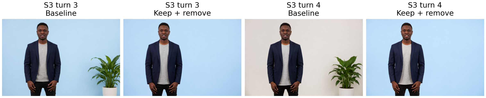
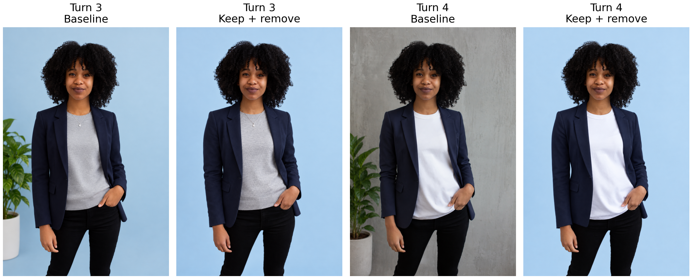

# 반복 인물 이미지 편집을 위한 유지 및 삭제 지시의 상태 갱신 제약

Explicit Preservation and Removal Constraints for State Updates in Iterative Portrait Editing

저자: 김미르, 장윤석

지도교수: 안남혁

## 초록

반복 이미지 편집에서는 새로 바꿀 내용뿐 아니라 유지하거나 삭제할 내용도 다음 프롬프트에 정확히 반영해야 한다. 본 연구는 언어 모델의 변경 추출과 재검토 뒤에 명시적인 유지·삭제 지시를 검사하는 보조 방법을 제안한다. 유지 규칙은 지원하는 문형에서 이전 상태를 보존하고, 삭제 규칙은 지원하는 항목을 없음으로 설정한다. 두 규칙은 요청의 근거 구절을 기록하며 모호한 표현에서는 개입하지 않는다. 개발과 분리하여 고정한 8개 대화 32턴에서 동일한 모델 응답을 네 방법에 적용했다. 전체 상태가 정확한 턴은 공통 기준 27, 유지 보호만 27, 삭제 실행만 28, 결합 방식 29였다. 결합은 최종 상태가 정확한 대화를 6개에서 7개로 높였으며 새 미변경 항목 훼손을 1건에서 0건으로 줄였다. 개선은 한 대화의 두 턴에 집중됐다. 추가로 고정한 T 세트의 8개 대화 32턴에서도 기준 28/32에서 유지·삭제 29/32로 높아졌으나 항목별 오류 격리를 더한 이점은 없었다. 두 인물의 이미지 평가에서는 3B 목표 점수가 350/384에서 358/384로, 사후 7B 평가에서는 372/384에서 374/384로 높아졌다. 그러나 판단 불가 감소와 설명·점수 모순이 있어 이미지 개선의 정량 근거는 제한적이다. 결과는 제한된 영어 문형의 상태 오류 감소를 보여주며 일반 사용자 대화의 성능 추정은 아니다.

주요어: 반복 이미지 편집, 요구 상태 관리, 명시적 유지, 명시적 삭제, 프롬프트 종합

## Abstract

Iterative portrait editing requires state updates that preserve or remove selected attributes without changing unrelated requirements. We implement bounded preservation and removal guards after a shared two-call extraction and review pipeline. The guards record evidence spans and abstain on unsupported expressions. On a frozen set S of eight synthetic dialogues comprising 32 turns, joint state accuracy was 27/32 for the common baseline, 27/32 for preservation alone, 28/32 for removal alone, and 29/32 for their combination. Correct final dialogue states increased from 6/8 to 7/8, with all gains occurring in two turns of one dialogue. On another frozen set T of eight dialogues, the combination improved joint accuracy from 28/32 to 29/32 and final dialogue accuracy from 7/8 to 8/8. Per-attribute error isolation added no further gain. An image study with two portrait references produced 66 unique outputs for 128 conditions. Primary 3B evaluation scores increased from 350/384 to 358/384, but six additional successes came from previously unknown judgments. A post-hoc 7B review scored 372/384 and 374/384 without unknown judgments, yet contradictory explanations remained. These results support complementary prevention of state-update errors within a restricted English grammar; they do not establish general conversational accuracy or overall image-quality improvement.

## 1. 서론

사용자가 인물 사진을 여러 번 편집하면 요청에는 추가, 변경, 유지, 삭제, 원본 복원이 섞인다. 예를 들어 배경은 그대로 두고 목걸이를 지우라는 요청을 전체 장면의 새 설명으로 바꾸면, 목걸이 삭제를 놓치거나 변경 대상이 아닌 배경까지 원본으로 되돌릴 수 있다. 원본 사진을 다시 참조하는 정책은 누적된 얼굴 변화를 줄이는 데 도움이 될 수 있지만, 잘못 정리한 목표까지 바로잡지는 않는다. 따라서 이미지 생성에 앞서 현재 요구 상태가 올바르게 갱신됐는지 확인해야 한다.

본 연구의 초점은 상태 추적 구조 자체보다 명시적인 지시를 검사하는 과정에 있다. 연구 질문은 같은 언어 모델 추출·재검토 결과를 사용할 때 명시적인 유지와 삭제 지시를 별도로 검사하는 것이 요청 상태의 오류를 줄이는가이다. 이를 위해 모델의 자유로운 재검토 결과를 그대로 신뢰하지 않고, 범위가 명확한 지시만 코드로 확인하는 보조 계층을 구현했다. 유지와 삭제를 각각 적용한 대조를 포함하여 두 기능을 결합해야 하는 경우를 분석한다.

## 2. 관련 연구

ChatEdit는 대화에서 편집 상태를 추적하고 이를 이미지 편집에 사용하는 구조를 제시했다[1]. 본 연구도 이 구성을 따르며, 상태 갱신 뒤의 유지·삭제 검사에 초점을 맞춘다. SOM-DST는 상태 갱신 동작을 예측하고 필요한 값만 생성하는 접근을 제안했다[2]. 이러한 동작 기반 상태 갱신과 달리 본 연구는 동일한 모델 응답에 적용하는 제한 문형의 후처리 효과를 비교한다.

Self-Refine은 모델의 피드백과 수정을 활용하는 방법이다[3]. 본 연구의 공통 기준은 요청에서 변경을 추출한 뒤 한 번 재검토하는 두 호출 구성이다. 이는 반복적인 Self-Refine 실험을 재현한 것이 아니라, 추가 모델 호출 수를 고정한 상태에서 후처리 규칙의 효과를 비교하기 위한 기준이다. 본 연구가 다루는 구체적인 문제는 재검토가 명시적 유지 지시를 어기거나, 삭제 누락으로 이전 물체를 남기는 경우이다.

## 3. 방법

### 3.1 상태와 공통 처리

현재 요구를 재킷, 상의, 핀, 목걸이, 배경, 소품의 여섯 항목으로 저장한다. 항목별로 허용된 속성 값과 원본을 사용하며 제거 가능한 재킷·핀·목걸이·소품에는 없음도 허용한다. 없음은 해당 대상을 제거하라는 요구이고 원본은 최초 사진의 상태를 복원하라는 요구이므로 서로 구별한다. 최초 상태는 모든 항목이 원본이다.

각 턴에서 Qwen3-4B-4bit[4]가 현재 요청의 변경을 JSON으로 추출하고, 같은 모델이 요청과 첫 응답을 받아 이를 재검토한다. 모델에는 정답 상태나 이전 정답을 제공하지 않는다. 이 실험의 추출기는 현재 요청만 읽으며 전체 대화나 방법별 이전 상태를 읽지 않는다. 따라서 두 호출의 원응답을 모든 방법에서 공유할 수 있다. 이전 상태의 적용과 검증은 이후 코드 단계에서 각 방법이 자기 상태를 대상으로 수행한다.

공통 코드는 허용 값 검사, 현재 값과 같은 변경의 생략, 명시적인 원본 복원을 처리한다. 그 다음 제안한 유지·삭제 제약을 적용한다. 정답은 모든 응답 저장 후 별도 채점에서만 사용한다. 완성된 상태는 동일한 문장 변환 함수를 거쳐 원본 사진에 대한 편집 프롬프트가 된다.

### 3.2 명시적 유지와 삭제

유지 보호는 지원하는 항목 이름과 unchanged가 함께 있는 명시적 구절에 한해 해당 항목의 직전 값을 보존한다. 단순히 keep이라는 단어가 있다는 이유로 보존하지 않는다. 예를 들어 keep the necklace off는 목걸이를 유지하라는 뜻이 아니므로 넓은 키워드 규칙은 잘못 동작할 수 있다. 값 변경, 인용, 조건부 표현, 대명사, 뒤에서 다시 언급한 같은 항목, 지원 어휘 밖 표현에서는 개입을 유보한다. 유보는 요청이 성공적으로 해석됐다는 뜻이 아니라 일반 추출 결과에 맡긴다는 뜻이다.

삭제 실행은 명시적인 remove 구절에서 재킷, 핀, 목걸이, 소품을 없음으로 설정한다. 상의와 배경의 삭제는 이 규칙의 지원 범위가 아니다. 유지와 마찬가지로 안전 조건을 통과한 구절만 사용하며 항목, 적용 값, 근거 문자열을 기록한다. 유지 보호 후 삭제 실행을 적용하되 뒤의 동일 항목 언급을 발견하면 앞선 보호가 적용되지 않도록 한다.

이 방법은 새 모델 학습이나 추가 추론 호출을 요구하지 않는다. 다만 제한 어휘와 문형에 의존한다. 과거 상태가 이미 틀렸다면 유지 규칙은 잘못된 값도 보존할 수 있으며, 지원하지 않는 표현의 의미 해석을 개선하지 못한다.

## 4. 실험 설계

### 4.1 개발 자료와 고정 검증

방법은 실패 후보를 분석하며 순차적으로 개발했다. P에서는 넓은 유지 보호가 기준 30/32를 32/32로 높였지만, 이후 경계 점검에서 off나 색 변경을 유지로 잘못 처리하는 결함을 확인했다. 새 Q 검증에서 넓은 규칙은 12/32로 낮아졌고, 문형을 좁힌 유지 규칙은 기준과 같은 27/32였다. 좁은 규칙도 최종 대화 정확 수가 6/8에서 5/8로 낮아 채택하지 않았다. 중간 턴의 잘못된 삭제를 막은 뒤, 다음 턴의 실제 삭제 요청을 모델이 놓친 사례가 원인이었다.

Q 분석 후 유지와 삭제를 결합한 코드를 개발하고, 새 S 대화 8종 32턴을 코드·프롬프트·모델 리비전과 함께 추론 전에 고정했다. P·Q 재계산은 개발 진단으로만 사용하며 S와 합산하지 않는다. S는 연구 보조 에이전트로 구성한 합성 편집 대화의 제한 문형 검사이다. 대화별 정답은 작성 시 지정한 항목별 변경을 순서대로 적용해 만들고 추론 전에 고정했다. 외부 사용자가 작성하거나 무작위로 수집한 대화는 아니다. 사진은 실제 인물 자료이지만 대화는 연구용으로 구성했다.

텍스트 모델 리비전은 4dcb3d101c2a062e5c1d4bb173588c54ea6c4d25이며 온도 0, 최대 260토큰, 공통 예시 7개를 사용했다. 32턴에 두 호출씩 실제 호출은 64회다. 공통 기준, 유지 보호만, 삭제 실행만, 두 기능 결합을 비교한다. 사전 채택 기준은 결합의 정확 턴 수 증가, 최종 대화 정확 수 비감소, 새 미변경 훼손 비증가이다. 두 단일 기능과 동률이면 결합의 추가 효과를 주장하지 않도록 정했다.

### 4.2 평가 단위

전체 상태 정확도는 여섯 항목이 모두 정답과 같은 턴 수이고 항목 정확도는 총 192항목 중 정확한 수다. 최종 대화 정확도는 마지막 턴의 여섯 항목이 모두 맞는 대화 수다. 새 미변경 훼손은 직전까지 맞았고 현재 요청에서도 값이 같아야 하는 항목을 이번 갱신에서 틀리게 바꾼 경우를 센다. 같은 대화의 여러 턴을 독립 표본으로 간주한 유의성 검정은 하지 않는다.

이미지 단계는 S 전체 32턴과 실제 인물 원본 2명, 두 방법의 128조건으로 정했다. 동일한 원본 바이트와 프롬프트는 같은 출력을 공유하여 66개 고유 생성 작업이 됐다. 실제로 입력이 다른 비교는 두 턴과 두 인물의 네 쌍이고 나머지 60쌍은 공유 입력이다. 내장 이미지 생성 도구의 첫 성공 출력만 보존한다. 내부 모델 리비전과 시드는 노출되지 않아 동일 시드 통제 실험이라고 부르지 않는다. 목표 반영은 모델 리비전 46d4cf06a06ffc1a766c214174f9cbed2f45bcab으로 고정한 Qwen2.5-VL-3B-4bit[5]가 6항목을 성공·실패·판단 불가로 판정하며, 얼굴은 InsightFace buffalo_l[6]의 코사인 유사도로 따로 측정한다. 방법명과 생성 프롬프트는 평가 모델에 제공하지 않는다. 사람 평가 작업은 포함하지 않는다.

원본 사진은 Monstera Production의 Pexels 사진 6311573과 6311581이다[7,8]. 각각 512×336, 512×768 크기의 기존 실험 입력을 재사용했다. 그림의 의상·장신구·배경은 AI 편집 결과이며 사진 속 인물의 실제 행동이나 연구 참여를 나타내지 않는다.

### 4.3 재현 자료

S와 T 각각의 요청·정답·모델 원응답·코드 해시를 저장했으며 이미지 단계는 입력 사진, 프롬프트, 첫 성공 출력과 평가 원문을 연결했다. 코드와 원자료는 연구 저장소의 request-contract-v3, isolated-contract-v1, contract-image-v3 폴더에서 확인할 수 있다[9]. 고정 후 재계산한 개발 진단은 별도 파일에 기록했다. 수치 검산은 원자료 해시와 본문의 표를 대조하며 실험의 독립 검증을 대신하지 않는다.

## 5. 결과

### 5.1 구성요소별 상태 정확도

| 방법 | 전체 상태 | 항목 | 최종 대화 | 새 훼손 |
| --- | --- | --- | --- | --- |
| 공통 기준 | 27/32 | 184/192 | 6/8 | 1 |
| 유지 보호만 | 27/32 | 185/192 | 6/8 | 0 |
| 삭제 실행만 | 28/32 | 186/192 | 6/8 | 1 |
| 유지·삭제 결합 | 29/32 | 187/192 | 7/8 | 0 |

결합은 공통 기준보다 정확한 턴이 2개 많았고 두 단일 구성요소도 각각 넘어 사전 채택 기준을 통과했다. 그러나 여덟 대화 전반에 개선이 퍼진 것은 아니다. S1, S2, S4, S5, S6, S8은 네 방법 모두 4턴이 정확했다. S7은 모두 1/4였으며 결합으로 해결되지 않았다. 방법 간 차이는 S3의 3턴과 4턴에서만 발생했다.

### 5.2 유지와 삭제의 상호 보완 사례

S3의 3턴은 식물을 삭제하고 재킷은 유지하도록 요청했다. 공통 기준과 유지 보호만 적용한 방법은 식물을 남겼다. 삭제 실행은 이를 없음으로 바꾸었다. 이어진 4턴은 상의와 목걸이를 원본으로 돌리되 재킷과 연한 파란색 배경은 그대로 두도록 요청했다. 공통 기준과 삭제 실행만 적용한 방법은 배경도 원본으로 바꾸었다. 유지 보호는 배경을 보존했지만, 단독으로는 이전 턴의 식물 삭제 누락이 남았다. 결합만 두 턴 모두 정확했다.

이 사례에서 한 턴에서는 실제 변경의 누락을 막아야 하고 다음 턴에서는 불필요한 변경을 막아야 한다. 보존만 강화하면 과거 객체가 남을 수 있고 삭제만 실행하면 다른 항목의 훼손이 남을 수 있다. 같은 모델 응답에 대한 구성요소별 비교는 이 두 오류가 서로 다름을 보여준다.

### 5.3 항목별 적용을 결합한 추가 검증

S에서 남은 오류는 항목별 적용과 결합한 사후 재계산에서 없어져 32/32가 됐다. 이 결과를 확인하기 위해 두 코드를 수정 없이 결합하고 새 T 대화 8종 32턴을 고정했다. 같은 추출·재검토 64호출을 공유한 T 결과는 표 2와 같다.

| 방법 | 전체 상태 | 항목 | 최종 대화 | 새 훼손 |
| --- | --- | --- | --- | --- |
| 공통 기준 | 28/32 | 187/192 | 7/8 | 3 |
| 항목별 적용 | 28/32 | 187/192 | 7/8 | 3 |
| 유지·삭제 | 29/32 | 189/192 | 8/8 | 1 |
| 항목별 적용+유지·삭제 | 29/32 | 189/192 | 8/8 | 1 |

T에서도 유지·삭제 제약은 정확한 턴과 최종 대화를 각각 한 개 높였으며 차이는 T7의 마지막 턴에서 발생했다. 항목별 적용을 추가한 이점은 없었다. 따라서 사후 S의 32/32를 결합 방법의 일반적인 효과로 보고하지 않고 더 단순한 유지·삭제 제약을 중심 방법으로 유지한다. S와 T는 서로 다른 개발 단계의 제한 문형 검사이며 표본 수를 합산하지 않는다.

### 5.4 이미지 단계

그림 1과 2는 입력이 달랐던 네 쌍 전체를 제시한다. 원본 출력의 영역을 자르거나 수정하지 않았다. 3턴에서 삭제 대상 식물이 기준 출력에는 남고 결합 출력에서는 사라진다. 4턴에서는 기준 출력이 식물과 원본 배경을 유지하는 반면 결합 출력은 식물을 제거하고 연한 파란 배경을 반영한다. 이 시각적 사례 설명은 별도 사람 평가 점수가 아니며 아래의 고정 AI 집계와 구분한다.

1차 AI 목표 충족은 기준 350/384와 결합 358/384였다. JSON 파싱 실패는 고유 평가 입력 68개 중 3개였다. 판독하지 못한 응답을 다시 채점하지 않고 판단 불가로 집계했다.

| 방법 | 목표 충족 | 판단 불가 | 6항목 모두 충족 | 얼굴 코사인 평균 |
| --- | --- | --- | --- | --- |
| 공통 기준 | 350/384 | 20 | 48/64 | 0.910458 |
| 유지·삭제 결합 | 358/384 | 13 | 50/64 | 0.910535 |

증가한 8개 성공 항목 중 6개는 판단 불가에서 성공으로 바뀌었고 실패에서 성공으로 바뀐 항목은 2개였다. R02 S3 3턴의 기준 평가가 JSON 대신 느낌표를 출력하여 6항목 모두 판단 불가가 된 영향이 크다. 또 같은 턴의 결합 출력에서는 소품이 없다는 설명과 ‘소품 없음’에 대한 실패 점수가 모순됐다. 따라서 증가분 전체를 실제 편집 오류의 해소로 해석하기 어렵다.

얼굴 코사인은 전체 평균 0.910458과 0.910535로 가까웠다. 입력이 다른 네 쌍의 평균 차이는 +0.001237이지만 두 쌍은 증가하고 두 쌍은 감소했다. 공유 출력 60쌍을 포함한 전체 평균의 작은 차이를 얼굴 보존 개선이나 비열등성의 증거로 삼지 않는다.

이러한 1차 평가의 한계를 확인한 뒤 같은 계열의 Qwen2.5-VL-7B-4bit로 전체 68개 출력·목표 쌍을 한 번 더 평가하는 민감도 분석을 고정했다. 목표 문구·파서·온도·최대 토큰은 같고 모델 리비전은 fdcc572e8b05ba9daeaf71be8c9e4267c826ff9b이다. 1차 점수는 보존하며 유리한 결과만 선택하지 않는다. 이 후속 평가는 사후 분석이고 독립 정답 검증이 아니다. 7B 평가에서는 목표 충족이 372/384에서 374/384로 높아졌고 JSON 파싱 실패와 판단 불가는 없었다.

| 방법 | 목표 충족 | 판단 불가 | 6항목 모두 충족 |
| --- | --- | --- | --- |
| 공통 기준 | 372/384 | 0 | 56/64 |
| 유지·삭제 결합 | 374/384 | 0 | 58/64 |

| 인물·대화·턴 | 3B 기준 | 3B 결합 | 7B 기준 | 7B 결합 |
| --- | --- | --- | --- | --- |
| R01 S3 3턴 | 5/6 | 5/6 | 6/6 | 6/6 |
| R01 S3 4턴 | 5/6 | 6/6 | 5/6 | 6/6 |
| R02 S3 3턴 | 0/6 | 5/6 | 6/6 | 6/6 |
| R02 S3 4턴 | 4/6 | 6/6 | 5/6 | 6/6 |

7B에서 실패에서 성공으로 바뀐 두 항목은 R01 4턴의 소품과 R02 4턴의 배경이다. 3B의 두 항목은 R02 4턴의 소품과 배경으로, 두 평가가 공통으로 실패→성공으로 판정한 것은 R02의 배경 한 항목이다. 고유 평가 입력의 점수 일치는 판단 불가 포함 367/408, 두 모델 모두 판정 가능한 항목에서는 367/387이었다.

큰 모델에서도 의미 판정의 모순은 남았다. 두 인물의 3턴 기준 출력에 식물이 보인다고 설명한 뒤 식물이 없다고도 설명하면서 모두 성공으로 채점했다. R02 4턴에서도 같은 소품 설명 모순이 나타났다. 원점수는 수정하지 않았다. 따라서 7B에서 형식 오류가 사라졌다는 사실이나 두 평가의 증가 방향만으로 전반적인 이미지 품질 개선을 확정할 수 없다.

앞서 P에서 유지 보호를 선택한 탐색적 이미지 실험은 128조건·68개 고유 출력으로 완료했다. 목표 충족은 기준 354/384와 보호 355/384, 얼굴 코사인 평균은 0.914851과 0.914108이었다. 실제 입력이 다른 네 쌍 중 R01-P2-2의 소품 판정 하나만 판단 불가에서 성공으로 바뀌었으며 확정 실패에서 성공으로 바뀐 항목은 없었다. JSON 파싱 실패 4개와 설명·점수 모순도 있었다. 따라서 P에서 뚜렷한 이미지 개선을 확인했다고 해석하지 않는다.

## 6. 논의

실무적으로 얻은 설계 원칙은 유지와 삭제를 독립적으로 점검하고 적용 근거를 남기는 것이다. 좁은 규칙은 모델이 이해할 수 있는 모든 문장을 대신하지 않으며, 지원 범위가 명확할 때만 개입한다. 유지 단어를 넓게 탐지하는 규칙의 Q 실패는 적용 범위를 제한해야 하는 근거이고, Q의 최종 상태 실패와 S3의 구성요소별 차이는 유지 보호만으로 충분하지 않은 근거이다.

결과의 적용 범위에는 세 가지 제한이 있다. 첫째, 두 검증은 각각 8개의 개발자 작성 대화이며 S의 개선은 한 대화에 집중됐다. 어휘와 문형도 제한되어 일반 사용자 대화의 평균 효과를 추정할 수 없다. 둘째, 텍스트 추출은 한 종류의 4B 모델에 한정되며, 추출기가 현재 요청만 읽으므로 대명사나 긴 문맥 해석을 포함하는 상태 추적 시스템과 직접 성능을 비교할 수 없다. 셋째, 이미지 비교는 두 인물과 한 도구를 사용하고 공유 출력이 많다. AI 평가의 판단 불가와 설명·점수 불일치는 원문에 보존하며 사람이 확정한 정답 평가로 취급하지 않는다. 얼굴 코사인도 사람이 느끼는 동일성 자체를 증명하는 지표는 아니다.

## 7. 결론

명시적인 유지와 삭제 지시를 모델 응답 뒤에서 검사하면 추가 모델 호출 없이 서로 다른 상태 오류를 줄일 수 있었다. S에서는 유지 보호만으로 남는 삭제 누락과 삭제 실행만으로 남는 배경 훼손을 함께 막았고, T에서도 정확한 턴과 최종 대화가 각각 한 개 증가했다. 항목별 오류 격리를 더한 이점은 없어 단순한 유지·삭제 방식을 선택했다. 이미지 단계에서는 입력이 달랐던 네 쌍의 차이를 확인했지만 두 AI 평가의 모순 때문에 전반적인 이미지 품질 개선까지 주장하지 않는다. 본 연구의 기여는 제한 문형에서 작동하는 요청 검사 방법과 두 구성요소가 필요한 오류 사례의 검증이다.

## 참고문헌

[1] X. Cui et al., “ChatEdit: Towards Multi-Turn Interactive Facial Image Editing via Dialogue,” EMNLP, pp. 14567–14583, 2023. https://aclanthology.org/2023.emnlp-main.899/

[2] S. Kim et al., “Efficient Dialogue State Tracking by Selectively Overwriting Memory,” ACL, 2020. https://aclanthology.org/2020.acl-main.53/

[3] A. Madaan et al., “Self-Refine: Iterative Refinement with Self-Feedback,” 2023. https://arxiv.org/abs/2303.17651

[4] A. Yang et al., “Qwen3 Technical Report,” arXiv:2505.09388, 2025. https://arxiv.org/abs/2505.09388

[5] S. Bai et al., “Qwen2.5-VL Technical Report,” arXiv:2502.13923, 2025. https://arxiv.org/abs/2502.13923

[6] InsightFace Contributors, “Model Zoo,” InsightFace. https://github.com/deepinsight/insightface/tree/master/model_zoo

[7] Monstera Production, “Confident black man in studio,” Pexels, photo 6311573. https://www.pexels.com/photo/confident-black-man-in-studio-6311573/

[8] Monstera Production, “Cheerful black woman in studio,” Pexels, photo 6311581. https://www.pexels.com/photo/cheerful-black-woman-in-studio-6311581/

[9] 김미르·장윤석, 반복 인물 이미지 편집 실험 코드 및 자료, inha-capstone repository, 2026. https://github.com/kimmireu0220/inha-capstone
