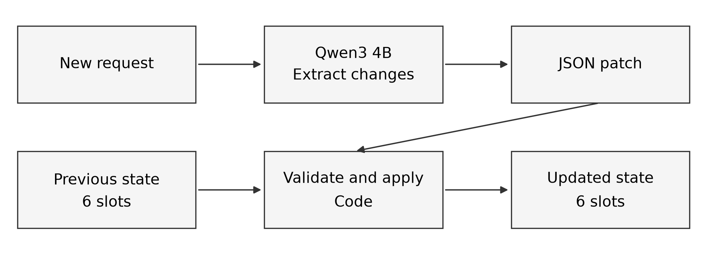

# 반복 인물 이미지 편집에서 원본 재생성과 최종 요구 종합의 비교

Original-Referenced Regeneration and Final-Request Synthesis for Iterative Portrait Editing

## 초록
반복 인물 이미지 편집에서는 생성물의 변형 누적과 대화의 최종 요구 추출 오류를 구분해야 한다. 합성 인물 6명의 최종 출력 18쌍에서 원본 기반 재생성의 평균 ArcFace는 0.922로 순차 편집의 0.714보다 높았다. 별도의 실제 인물 6명·8턴 대화 3종·두 시드 비교에서는 자연어 에이전트 종합이 전체 대화 전달보다 목표 충족을 높였지만(168/216 대 96/216) 얼굴 유사도는 낮았다(0.585 대 0.733). 취소 요청 처리의 후속 실험에서는 새 대화 4종으로 96장을 생성하고, 새 요청의 변경 항목을 추출해 코드로 갱신하는 방법을 평가했다. 1차 AI 목표 충족은 자연어 종합 194/288에서 상태 갱신 240/288로, 평균 ArcFace는 0.586에서 0.675로 높아졌다. 다만 한 대화에서는 배경·소품 교체를 놓쳐 상태 갱신의 목표 점수가 더 낮았다. 2차 AI는 257/288과 261/288로 작은 차이를 보였으며, 두 AI의 핀 항목 일치는 34/96에 그쳤다. 전체 대화 상태 추출의 추가 48개 조건에서는 1차·2차 목표 충족이 127/288·142/288로 낮았지만 ArcFace는 0.847로 높았다. 형식 오류로 편집을 수행하지 않은 출력도 포함되어 얼굴 유사도만으로 성공을 판단할 수 없었다. 결과는 최종 요구 관리와 이미지 생성 제어, 평가 신뢰도를 함께 검토할 필요성을 보여 준다. 단일 생성 모델과 소수 인물, 개발자 작성 대화에 한정된 탐색적 연구이며 독립 인간 평가는 확보하지 않았다.

주요어: 반복 이미지 편집, 얼굴 보존, 원본 기반 재생성, 최종 요구 종합, 프롬프트

## 1. 서론
사용자는 인물 사진에서 의상, 장신구, 배경을 차례로 바꾸고 이전 요청을 수정하거나 취소할 수 있다. 편집기는 현재 이미지를 다시 입력하거나 최초 사진에서 최신 요구를 한 번에 생성할 수 있다. 전자는 이전 생성물의 변화가 다음 생성으로 전달되고, 후자는 대화의 최종 상태를 정확히 정리해야 한다. 얼굴 보존과 목표 반영은 서로 다른 성능 축이다.

본 연구의 질문은 두 가지다. 첫째, 같은 최종 요구에서 직전 출력을 잇는 방식과 최초 원본에서 재생성하는 방식은 얼굴 보존에 어떤 차이가 있는가? 둘째, 수정과 취소가 포함된 대화의 최종 프롬프트를 어떻게 구성해야 목표를 반영하며, 그 과정에서 얼굴 보존은 어떻게 달라지는가? 첫 질문에는 합성 인물의 쌍별 정책 비교를 사용한다. 둘째에는 실제 인물의 대화 종합 비교와 새 요청마다 상태를 갱신하는 후속 비교, 전체 대화에서 구조화된 상태를 추출하는 추가 대조를 사용한다. 서로 다른 과제의 결과를 합산하거나 하나의 인과 효과로 해석하지 않는다.

## 2. 관련 연구
MagicBrush는 단일·다중 턴 지시 편집 자료를 제공한다[1]. LPIPS는 심층 특징을 이용한 지각적 거리 지표이며[2], ArcFace는 얼굴 인식 임베딩의 특징 비교에 사용된다[3]. 본 연구에서는 LPIPS를 원본과 최종 얼굴 영역의 거리로, ArcFace 코사인 유사도를 얼굴 특징 보존의 대리 지표로 사용한다. 두 지표만으로 편집 요청의 충족 여부를 판정하지 않고 별도 육안 점수를 기록한다.

대화 상태 추적에서는 변경할 항목을 선택하고 나머지 값을 이전 턴에서 유지하는 접근이 연구되었다. Guo 등은 갱신 대상 선택과 값 생성을 나누고, 선택되지 않은 항목의 이전 값을 유지했다[4]. 본 연구의 자동 상태 갱신은 이와 관련된 상태 관리 원리를 제한된 인물 편집 항목에 적용한다. 항목별 상태 관리 자체를 새로운 알고리즘으로 주장하기보다, 최종 프롬프트 종합 및 이미지 생성과 연결했을 때의 효과와 오류를 평가한다.

Hao 등의 Promptist는 사용자 입력을 이미지 모델에 적합한 프롬프트로 바꾸기 위해 지도 학습과 강화 학습을 사용하고, 사용자 의도를 유지하면서 이미지의 미적 품질을 높이는 목적을 다뤘다[5]. 본 연구는 모델을 추가 학습하지 않고 고정된 언어 모델로 수정·취소 이력의 최종 상태를 추출한다. 프롬프트 문장의 품질과 대화의 최신 요구를 유지하는 능력을 구분해 평가한다.

Huang 등의 T2I-CompBench는 색·형태·질감의 속성 결합과 공간 관계, 복합 구성을 별도 과제로 평가했다[6]. 이 구분은 핀의 색·형태·좌우를 한꺼번에 충족해야 하는 본 연구의 항목과 관련된다. 얼굴 유사도나 전체적인 이미지 인상만으로 해당 목표의 달성을 판단하기 어려워 목표 항목별 점수를 함께 보고한다. 본 연구의 대화와 이미지는 별도로 작성·생성한 자료이며 해당 벤치마크의 점수와 직접 비교하지 않는다.

## 3. 연구 방법
### 3.1 합성 인물의 입력 정책 비교
합성 인물 P01–P06을 대상으로 남색 셔츠, 옅은 파란 배경, 은색 핀의 세 편집을 적용했다. 순차 방식은 매 단계 직전 출력을 입력으로 사용하여 세 번 생성한다. 원본 기반 방식은 세 요구를 모은 최종 프롬프트와 최초 원본으로 한 번 생성한다. 각 인물에 시드 42, 314, 2026을 적용하여 최종 출력 36장, 대응 비교 18쌍을 얻었다. 중간 순차 출력까지 포함한 전체 생성물은 72장이다. 같은 쌍의 최종 상태와 프롬프트, 원본·중간 출력의 입력 계보를 해시로 검증했다. 인물별 세 회는 반복 관측이다.

얼굴 영역은 실험 전에 정한 인물별 좌표를 입력 크기에 맞춰 적용했다. 원본과 최종 출력의 얼굴 LPIPS와 SSIM, 얼굴 정렬 후 ArcFace 코사인 유사도를 계산했다. LPIPS는 낮고 SSIM·ArcFace는 높을수록 원본과 가깝다. 편집 요소의 반영은 비교 이미지를 별도로 확인했다.

### 3.2 실제 인물의 최종 요구 종합 비교
공개 사진의 실제 인물 R01–R06에 서로 다른 8턴 편집 이력 H1–H3을 적용했다. 각 이력에는 재킷, 핀, 목걸이, 배경의 수정 또는 취소가 포함된다. H1은 도서관과 회색 재킷, H2는 정원과 초록 재킷, H3는 재킷과 핀을 제거한 최종 상태다. 생성 전에 이력, 최종 목표 6항목, 프롬프트를 고정했다. 사람×이력×시드 42·314의 36세트마다 세 방법을 비교하여 총 108장을 얻었다. 이전 예비 실험과 조건이 같은 12장은 해시 확인 후 재사용했고 96장을 새로 생성했다. 확대 비교의 육안 점수는 전부 같은 기준으로 다시 채점했다.

대화 전체 전달은 모든 요청과 최신 요청 우선 규칙을 이미지 모델에 준다. 에이전트 종합은 로컬 Qwen3 4B가 자연어 이력을 읽어 초안 작성과 원문 대조를 거쳐 최종 프롬프트를 만든다. 정확한 상태 제공은 사람이 미리 구조화한 변경을 순서대로 적용한 최종 상태만 이미지 모델에 준다. 정확한 상태는 올바른 상태 추출을 이미 가정한 상한 기준이며 나머지 방법과 같은 자동화 비용이 아니다. 세 방법 모두 동일한 최초 사진을 입력하고 로컬 FLUX.2 Klein 4B 4비트 모델, 4스텝, 대응 시드를 사용했다. 출력 확인 후 프롬프트를 수정하지 않았다.

방법명을 가린 비교판에서 최종 목표 6항목을 각 이미지에 대해 충족(1), 미충족(0), 판단 어려움으로 채점했다. 판단 어려움은 성공으로 계산하지 않았다. 얼굴은 InsightFace buffalo_l로 검출·정렬한 뒤 원본–출력 ArcFace 코사인 유사도를 구했다. 108장 모두 한 얼굴이 검출되었다. 평가 원기록은 운영자의 단일 시각 판정으로 되어 있으며, 독립 인간 평가를 확인할 자료는 없다. R01–H2–시드42의 한 세트는 가림 전 이미지가 노출된 예외가 있다. 분석의 독립 단위는 6명이고 이력·시드는 인물 내 반복이다.

### 3.3 자동 요구 상태 갱신의 후속 비교
기존 H1–H3에서 확인한 취소 처리 문제를 검증하기 위해 새 대화 U1–U4를 고정했다. 각 대화는 8턴이며 재킷, 상의, 핀, 목걸이, 배경, 배경 소품의 여섯 항목을 다룬다. 삭제, 교체, 재추가와 ‘제거하지 말라’는 요청을 포함한다. 개발 중 사용한 T1–T4와는 별도이지만 같은 개발자가 제한 어휘로 작성한 대화이므로 독립적으로 수집한 사용자 자료는 아니다.

자동 상태 갱신은 Qwen3 4B가 새 요청 하나에서 변경 항목과 값을 JSON으로 추출하고, 코드가 이전 상태에 적용하는 방식이다(그림 1). 언어 모델에는 과거 상태를 제공하지 않는다. 코드는 지원 항목과 값, 요청에 등장하는 색·종류·위치 단어를 확인하며 삭제값과 미변경 항목을 유지한다. 검증 실패 시 한 번 재시도하고 다시 실패하면 이전 상태를 유지하며 거부 기록을 남긴다. 최신 여섯 항목만 정해진 문장으로 바꿔 최종 이미지 프롬프트를 만든다. 범위가 정해진 어휘 검사는 문장의 의미를 완전히 검증하지 못한다.

비교 대상은 기존의 전체 대화 초안 작성·대조 2회 방식이다. 실제 인물 R01–R06, 대화 4종, 시드 42·314, 두 방법으로 96개 조건과 최종 48쌍을 설계했다. 최초 원본, 이미지 모델과 생성 스텝은 이전 실제 인물 실험과 같다. 자동 프롬프트를 모두 고정한 뒤 정답 상태와 비교하며, 오류가 있는 프롬프트도 그대로 생성에 사용한다. 두 방법은 언어 모델 호출 수가 달라 시스템 전체의 비교로 해석하고 호출 수와 처리 시간을 함께 기록한다.

최종 이미지의 여섯 목표는 방법명을 가린 Codex 시각 판정과 별도 로컬 Qwen2.5-VL 3B 판정으로 평가한다. 두 판정의 점수와 일치율을 각각 보고하고, 판단 불가 항목은 성공으로 계산하지 않는다. 두 평가 모두 AI 평가이며 독립 인간 평가는 확보하지 않았다. 얼굴 유사도는 모든 시각 점수를 기록한 뒤 결합한다. 반복 관측의 독립 단위는 인물 6명이며, 대화 수가 4종이라는 한계도 함께 고려한다.

### 3.4 전체 대화에서 상태를 추출하는 추가 대조
자동 상태 갱신과 자연어 종합의 차이에는 누적 상태 관리뿐 아니라 출력 형식, 지시문, 호출 수의 차이도 포함된다. 이를 더 구체적으로 해석하기 위해 전체 대화에서 최종 여섯 항목을 한 번에 추출하는 대조를 설계했다. 같은 Qwen3 4B가 첫 호출에서 최종 JSON 상태를 작성하고, 두 번째 호출에서 원래 대화와 대조한다. 두 호출 모두 온도 0, 최대 700토큰이며 예시 정답은 제공하지 않는다. 두 번째 출력이 형식상 유효하면 사용하고, 그렇지 않으면 첫 번째 유효 출력으로 되돌린다. 둘 다 실패하면 모든 항목을 원본 유지로 설정하고 실패를 기록한다. 최종 상태를 이미지 프롬프트로 바꾸는 코드는 자동 상태 갱신과 같다.

이 대조는 U1 일부 이미지와 상태 추출 오류를 확인한 뒤 사전 명세했으며, 기존 U1–U4를 재사용하는 후속 진단이다. 새로운 대화에 대한 독립 일반화 검증이나 상태 관리 한 요소만의 인과 효과로 해석하지 않는다. 같은 인물 6명, 대화 4종, 시드 2개인 48개 조건을 추가 비교한다. 원본·프롬프트 바이트·이미지 모델·스텝·크기·시드가 모두 같은 기존 출력은 해시를 확인해 재사용하며, 해당 이미지의 기존 평가도 연결한다. 재사용 이미지를 새로운 독립 반복으로 세지 않고 새 생성 수와 추가 비용을 분리한다. PNG의 기록 정보가 달라도 실제 이미지가 같을 수 있으므로 크기와 RGB 픽셀의 해시도 별도로 계산한다. 동일 픽셀 결과가 서로 다른 대화 조건에 나타나면 조건별 목표를 각각 평가하되 고유 이미지 수와 구분한다. 새로운 출력에는 같은 목표와 두 AI 평가자를 적용한다. 기존 이미지를 본 이력이 있어 완전한 신규 가림 평가로 주장하지 않는다.

추가 대조의 1차 AI 점수는 후속 대화형 평가에서 기록하고 기존 두 방법의 점수는 이전 기록을 연결한다. 따라서 세 방법 모두를 같은 시점의 단일 고정 대화형 모델로 새로 채점한 비교는 아니다. 2차 로컬 평가에서는 기존과 같은 모델 버전과 평가 문구를 사용하며 두 평가 결과를 분리해 보고한다.

### 3.5 재현 조건과 자료 사용
각 실험의 입력 정책, 프롬프트, 시드, 출력 해시, 점수 및 검증 기록은 저장소에 보존한다. 실제 인물 사진의 출처와 사용 범위도 기록했다. 공개 사진의 편집 허용과 연구 대상자의 별도 동의는 다른 문제이므로, 본문에는 실제 인물의 식별 가능한 비교 이미지를 싣지 않았다. 초상권·모델 이용 조건을 별도로 확인해야 외부 공개 범위를 확장할 수 있다.

## 4. 결과
### 4.1 원본 기반 재생성의 얼굴 보존
합성 인물의 최종 18쌍에서 원본 기반 방식의 얼굴 LPIPS·SSIM·ArcFace가 모두 18쌍에서 더 유리했다(표 1). 인물별 세 회 평균 ArcFace도 6명 모두 원본 기반 방식이 높았다. 이는 이 과제와 모델에서 직전 생성물의 재입력보다 원본 재생성이 얼굴 특징을 더 가깝게 유지했음을 뜻한다. 두 방식의 생성 횟수는 각각 1회와 3회이므로, 차이를 원본 참조만의 독립 효과로 분리할 수는 없다.

| 방법 | 얼굴 LPIPS ↓ | 얼굴 SSIM ↑ | ArcFace ↑ | 유리한 대응쌍 |
| --- | ---: | ---: | ---: | ---: |
| 원본 기반 재생성 | 0.087120 | 0.846176 | 0.922054 | 18/18 |
| 순차 편집 | 0.108710 | 0.768563 | 0.713703 | — |

실제 인물 두 명의 별도 예비 정책 비교에서도 원본 기반 ArcFace는 R01 0.842260, R02 0.943947로 순차 편집의 0.555040, 0.740218보다 높았다. 각 인물에 한 번만 적용한 탐색적 결과이며 합성 인물의 18쌍에 합산하지 않았다.

### 4.2 최종 요구 종합의 목표 충족과 얼굴 유사도
실제 인물의 36세트에서 6항목씩 평가한 216항목의 목표 충족은 대화 전체 96개(44.4%), 에이전트 종합 168개(77.8%), 정확한 상태 199개(92.1%)였다(표 2). 에이전트의 목표 점수는 6명 각각에서 대화 전체보다 높았다. 반면 평균 ArcFace는 에이전트 0.585017, 대화 전체 0.732527, 정확한 상태 0.734518로 에이전트가 6명 각각에서 다른 두 방법보다 낮았다. 따라서 목표 반영의 개선이 얼굴 보존 개선을 보장하지 않았다.

| 프롬프트 방법 | 목표 충족 | 충족률 | 원본 대비 ArcFace ↑ |
| --- | ---: | ---: | ---: |
| 대화 전체 전달 | 96/216 | 44.4% | 0.732527 |
| 에이전트 종합 | 168/216 | 77.8% | 0.585017 |
| 정확한 최종 상태 | 199/216 | 92.1% | 0.734518 |

인물별 반복 관측을 묶어 보면 목표 점수와 얼굴 유사도 사이의 상충이 특정 사진 하나에만 의존하지 않는다(표 3). 목표 항목은 인물당 방법별 36개다. 인물 간 얼굴 유사도의 출발점은 달라 수치를 인물 간 절대 순위로 해석하지 않고 같은 인물 안에서 방법을 비교했다. R01은 원본 얼굴이 작아 다른 인물보다 유사도 자체가 낮았지만, 두 방법의 방향은 같았다.

| 인물 | 대화 목표 | 에이전트 목표 | 대화 ArcFace | 에이전트 ArcFace |
| --- | ---: | ---: | ---: | ---: |
| R01 | 19/36 | 28/36 | 0.387 | 0.366 |
| R02 | 18/36 | 27/36 | 0.885 | 0.692 |
| R03 | 17/36 | 29/36 | 0.833 | 0.715 |
| R04 | 16/36 | 28/36 | 0.521 | 0.392 |
| R05 | 13/36 | 27/36 | 0.897 | 0.743 |
| R06 | 13/36 | 29/36 | 0.872 | 0.602 |

이력별 결과는 표 4와 같다. H1·H2에서는 에이전트 종합이 대화 전체보다 높았지만, H3에서는 차이가 작고 정확한 상태와의 격차가 컸다. 생성 전에 기록한 프롬프트 감사에서 H3 에이전트 프롬프트에는 취소된 남색 재킷, 은색 핀, 은색 목걸이 세 조건이 남아 있었다. H3 이미지의 ‘재킷 없음’ 충족은 에이전트 0/12, 정확한 상태 12/12였고 ‘핀 없음’은 각각 1/12, 12/12였다. 취소 조건을 남긴 프롬프트와 출력 실패가 동반되었으나, 이를 유일한 원인으로 단정할 수는 없다.

| 편집 이력 | 대화 전체 | 에이전트 종합 | 정확한 상태 |
| --- | ---: | ---: | ---: |
| H1 도서관·회색 재킷 | 35/72 | 70/72 | 68/72 |
| H2 정원·초록 재킷 | 27/72 | 60/72 | 60/72 |
| H3 재킷·핀 제거 | 34/72 | 38/72 | 71/72 |

H2의 화면 기준 왼쪽 옷깃에 빨간 삼각 핀 하나를 놓는 항목은 대화 전체 0/12, 에이전트 1/12, 정확한 상태 0/12였다. 이는 최종 상태를 정확히 전달해도 생성 모델의 세부 위치 제어가 실패할 수 있음을 보여 준다. 판단 어려움 두 항목을 성공으로 세지 않았고, 가림 예외 세트 한 개를 제외해도 방법 순서는 대화 전체 93/210, 에이전트 162/210, 정확한 상태 194/210으로 같았다.

### 4.3 자동 상태 갱신의 효과와 실패
U1–U4의 48쌍에서 1차 AI 평가의 목표 충족은 자연어 에이전트 종합 194/288(67.4%), 자동 상태 갱신 240/288(83.3%)이었다. 원본 대비 평균 ArcFace는 각각 0.585593과 0.675335였다. 취소된 항목만 보면 각각 26/72와 72/72였다. 취소 항목의 개선은 전체 목표의 완전한 달성과는 다르다. 이 점수는 방법명을 가린 AI 판정이며 인간 평가 결과가 아니다.

| 방법 | 1차 AI 목표 | 2차 AI 목표 | 1차 AI 취소 목표 | ArcFace ↑ |
| --- | ---: | ---: | ---: | ---: |
| 에이전트 종합 | 194/288 | 257/288 | 26/72 | 0.585593 |
| 자동 상태 갱신 | 240/288 | 261/288 | 72/72 | 0.675335 |

인물별로 묶은 1차 목표 충족과 얼굴 유사도는 6명 모두 자동 상태 갱신이 높았다(표 6). 그러나 인물은 6명이고 같은 네 대화를 반복하므로, 이를 새로운 대화 전반의 성능 보장으로 해석하지 않는다.

| 인물 | 종합 목표 | 상태 갱신 목표 | 종합 ArcFace | 상태 갱신 ArcFace |
| --- | ---: | ---: | ---: | ---: |
| R01 | 33/48 | 40/48 | 0.352 | 0.377 |
| R02 | 33/48 | 40/48 | 0.708 | 0.805 |
| R03 | 32/48 | 40/48 | 0.666 | 0.765 |
| R04 | 32/48 | 40/48 | 0.374 | 0.506 |
| R05 | 32/48 | 40/48 | 0.774 | 0.838 |
| R06 | 32/48 | 40/48 | 0.641 | 0.760 |

2차 AI 목표 충족은 자연어 종합 257/288, 자동 상태 갱신 261/288로 방법 간 차이가 작았다(표 5). 두 AI의 항목별 일치는 470/576(81.6%)였으나 핀 항목은 34/96(35.4%)였고, 2차 AI만 성공으로 판정한 핀 항목은 61개였다. 2차 평가에는 형식 파싱 실패가 없었지만, 유효한 JSON이 정확한 판정을 보장하지 않았다. 목표 충족 개선의 크기는 평가자에 민감하며, 두 AI가 큰 개선을 일관되게 재현했다고 주장할 수 없다.

대화별로는 U1에서 13/72 대 72/72, U2에서 60/72 대 60/72, U3에서 62/72 대 72/72, U4에서 59/72 대 36/72였다(에이전트 종합 대 자동 상태 갱신). U4에서는 자동 상태 갱신이 배경과 소품 교체를 놓쳐 이전의 도서관과 조명을 유지했다. 따라서 전체 평균의 개선을 모든 대화에서의 우위로 해석할 수 없다. U2와 U4의 핀 항목은 두 방법 모두 각 0/12였으며, 정확한 상태 전달과 이미지 생성기의 위치·형태 제어는 별도 문제로 남았다.

자동 상태 추출은 전체 턴의 항목에서 186/192, 변경 대상 항목에서 50/52, 여섯 항목이 모두 맞는 턴에서 29/32를 기록했다. 최종 상태는 22/24항목, 대화 단위로는 3/4가 정확했다. 지원 값과 요청 단어를 검사하는 코드만으로 모든 의미 오류를 막지는 못했다. 네 대화의 프롬프트 준비에는 자연어 종합 8회·106.2초, 자동 상태 갱신 33회·242.3초가 기록되었다. 준비된 프롬프트는 인물과 시드에 걸쳐 재사용했다. 시간은 완료된 준비 기록의 합이며, 중단된 준비 작업과 모델 로딩을 포함한 전체 벽시계 시간이나 비용 우위를 뜻하지 않는다.

평가 과정의 예외도 보존했다. 첫 여섯 비교 뒤 대화형 AI의 모델 설정이 바뀌어 1차 평가 전체를 단일 고정 모델의 판정으로 볼 수 없다. 또한 방법 공개 전에 비교판 경계를 추가해 확인한 결과, 옆 이미지의 책장을 잘못 귀속했던 배경 점수 두 항목을 수정했다. 2차 고정 AI에서는 설명에 재킷이나 핀이 있다고 쓰면서 ‘없음’ 목표를 충족으로 채점하는 모순 사례가 관찰되었다. 원문과 점수를 변경하지 않으며, 이 보조 판정을 정확성의 독립 검증으로 해석하지 않는다.

### 4.4 전체 대화 상태 추출의 형식 오류와 목표 충족
전체 대화에서 여섯 항목을 추출하는 추가 대조의 최종 상태는 10/24항목이 정확했고, 여섯 항목 모두 맞는 대화는 0/4였다. U1은 재킷 제거를 놓쳤고 U4는 배경 교체를 놓쳐 각각 5/6항목이 맞았다. U2·U3에서는 두 호출 모두 항목 값으로 문자열 대신 배열을 반환했다. 미리 정한 형식 검증을 통과하지 못해 모든 항목을 원본 유지로 설정했고 각각 0/6을 기록했다. 이 실패 처리를 포함한 프롬프트를 그대로 이미지 생성에 사용했다.

U2의 배열에는 요구된 값과 원본 유지 값이 함께 있었고, U3에는 하나의 값을 담은 배열이 있었다. 따라서 최종 상태 점수에는 대화 이해뿐 아니라 출력 형식 준수와 실패 처리 규칙의 영향이 포함된다. 허용 값 목록을 제시한 지시를 모델이 출력 배열로 해석했을 가능성도 있다. 결과를 본 뒤 배열의 첫 값을 취하거나 프롬프트를 고쳐 재채점하지 않았다. 이 대조만으로 점진적 상태 갱신 자체가 전체 대화 추출보다 우수하다고 결론 내릴 수 없다.

추가 48개 조건은 모두 새로 생성했고 기존 실험 출력의 정확한 재사용은 0개였다. 다만 U2·U3에 같은 원본 유지 프롬프트가 적용되어 같은 인물·시드에서 픽셀이 동일한 12쌍이 생겼다. PNG 기록 정보를 제외한 고유 RGB 이미지는 36종이다. 이 반복을 새로운 독립 표본으로 취급하지 않는다. 1차 AI 목표 충족은 127/288이며 목걸이 한 항목은 판단 불가로 기록했다. 48장 모두 얼굴 하나가 검출됐고 평균 ArcFace는 0.846995였다. 목표 반영은 낮으면서 얼굴 유사도는 높아, 얼굴 지표만으로 편집 시스템을 우수하다고 평가할 수 없음을 보여 준다.

| 방법 | 1차 AI 목표 | 2차 AI 목표 | ArcFace ↑ |
| --- | ---: | ---: | ---: |
| 에이전트 종합 | 194/288 | 257/288 | 0.585593 |
| 자동 상태 갱신 | 240/288 | 261/288 | 0.675335 |
| 전체 대화 상태 추출 | 127/288 | 142/288 | 0.846995 |

세 방법을 연결한 결과는 표 7과 같다. 기존 두 방법의 이미지와 점수는 변경하지 않았다. 추가 대조의 2차 AI 목표 충족도 142/288로 낮았으나, 재킷이 있다고 설명하면서 ‘재킷 없음’을 성공으로 채점하는 모순은 다시 관찰됐다. 2차 평가의 JSON 파싱 실패는 0개였다. 기존 결과를 포함한 두 AI의 항목 일치는 693/863이고 한 항목은 1차 판단 불가로 일치율에서 제외했다. 이는 서로 다른 시점의 평가와 기존 점수 재사용을 포함한 기술적 집계이며 정확성 검증은 아니다.

추가 대조의 프롬프트 준비는 8회 호출·61.4초였고 이미지 생성 기록의 합은 5,428.7초였다. 상태 갱신보다 준비 호출 수가 적지만, 형식 실패와 원본 유지 처리까지 포함하므로 비용과 목표 반영을 함께 봐야 한다. 특히 U2·U3의 평균 ArcFace는 모두 0.919로 높았지만 요청된 편집 대부분은 반영되지 않았다. 구조화된 형식만 지정해도 올바른 최종 요구가 보장되지 않으며, 실패 시 원본 유지가 얼굴 지표를 높이는 결과를 만들 수 있다.

## 5. 논의
입력 정책과 프롬프트 비교는 반복 편집의 서로 다른 실패 지점을 보여 준다. 합성 인물 실험에서는 원본을 다시 입력하는 편집 정책이 얼굴 특징 보존에 유리했다. 실제 인물 실험에서는 동일한 원본을 사용해도 프롬프트 구성에 따라 최종 목표와 얼굴 특징이 서로 다른 방향으로 움직였다. 정확한 최종 상태의 높은 점수는 상태 추출과 취소 처리의 중요성을 드러내지만, 이를 실제 에이전트 성능으로 해석할 수 없다. H3의 과거 조건 잔존은 단순한 대화 요약이 최종 상태 관리와 다름을 보여 준다. H2의 핀 위치 실패는 상태 관리 이후에도 이미지 생성기의 속성·위치 제어 검사가 필요함을 보여 준다.

후속 비교에서는 새 요청에서 변경 항목을 추출하고 코드로 상태를 갱신하는 방법을 실제로 평가했다. 1차 AI 기준 목표 충족과 ArcFace 평균은 개선되었고 취소 항목의 실패가 줄었다. 반면 U4에서는 배경·소품 변경을 놓쳐 목표 점수가 낮아졌으며, 2차 AI는 큰 목표 점수 차이를 재현하지 못했다. 이 결과는 제한 어휘의 상태 갱신이 유용할 가능성과 함께, 상태 추출 오류 및 평가자 의존성을 보여 준다. 상태 관리의 도입만으로 모든 편집 실패를 해결했다고 주장하지 않는다.

구현된 로컬 편집기는 최초 원본, 현재 요구 상태, 출력 버전을 분리해 저장하고 순차 생성과 원본 기반 재생성을 제공한다. 연구용 여섯 항목 상태 갱신 CLI는 기존 웹 편집기와 별도이며, 연구 결과가 웹 UI 전체의 기능 검증을 뜻하지 않는다. 후속 개선 과제는 생성 전에 최종 상태의 근거 요청을 확인하고, 생성 후에는 속성 반영과 얼굴 유사도를 함께 검증하는 것이다. 특히 핀의 좌우·형태처럼 AI 평가자 간 차이가 큰 항목에는 독립 인간 판정이 필요하다.

정책 비교와 프롬프트 비교의 인물 유형·편집 과제가 달라 두 요소의 상호작용을 추정할 수 없다. 합성 인물 실험의 방법별 생성 횟수도 다르다. 실제 인물 실험은 공개 사진 6명, 개발자가 작성한 H1–H3 및 U1–U4, 두 시드, 하나의 로컬 이미지 모델에 한정된다. 초기 H1–H3 점수는 독립 인간 평가를 확인할 수 없는 단일 시각 판정 기록이고, 두 항목의 판단 어려움과 한 세트의 사전 노출 예외가 있다. U1–U4의 두 평가는 모두 AI이며 1차 모델 설정 변경과 채점 수정 이력, 2차 설명–점수 모순을 공개했다. 두 AI의 일치가 곧 정확성을 의미하지 않는다. ArcFace는 얼굴 정체성의 대리 지표로 자세·구도·조명 영향에서 완전히 자유롭지 않다. 108장 또는 96장을 각각 독립 표본으로 취급한 유의성 검정이나 모집단 일반화는 하지 않았다. 프롬프트 준비 시간은 중단된 작업을 제외한 기록값이며 다른 프로세스의 영향을 받을 수 있어 표준화된 속도 벤치마크로 해석하지 않는다.

전체 대화 상태 추출 대조에서는 형식 오류로 원본 유지 처리가 적용돼 목표 반영이 낮아졌다. 이때 얼굴 유사도가 높았다는 점은 얼굴 보존과 편집 수행을 함께 평가해야 한다는 해석을 뒷받침한다. 다만 대조는 같은 대화를 재사용한 후속 진단이고 추출 지시·예시·호출 수가 다르며 1차 채점 시점도 달라, 상태 관리만의 인과 효과를 분리한 비교는 아니다.

## 6. 결론
반복 인물 편집의 실패는 입력 이미지 정책, 최종 요구 상태 추출, 이미지 생성의 세부 제어로 나누어 평가할 필요가 있다. 합성 인물의 대응 18쌍에서는 원본 기반 재생성이 순차 편집보다 얼굴 LPIPS와 ArcFace에서 모두 유리했다. 실제 인물의 H1–H3 비교에서는 에이전트 종합이 전체 대화 전달보다 목표를 더 많이 충족했으나 얼굴 유사도는 낮았다. U1–U4 후속 비교에서 자동 상태 갱신은 1차 AI 목표 점수와 얼굴 유사도를 높였지만 특정 대화에서는 악화됐고, 2차 AI의 목표 점수 차이는 작았다. 추가 대조에서는 전체 대화 상태 추출의 형식 오류로 원본 유지 처리가 발생했고 목표 충족이 낮으면서 얼굴 유사도는 높았다. 정확한 상태 전달 이후에도 핀 위치·형태 오류는 남았다. 이 결과는 상태 관리와 얼굴·속성 평가를 함께 설계할 근거를 제공하지만, 소수 인물과 개발자 작성 대화, AI 평가에 한정된 탐색적 근거다.

## 참고문헌
[1] K. Zhang, L. Mo, W. Chen, H. Sun, and Y. Su, “MagicBrush: A Manually Annotated Dataset for Instruction-Guided Image Editing,” NeurIPS, 2023. https://arxiv.org/abs/2306.10012

[2] R. Zhang, P. Isola, A. A. Efros, E. Shechtman, and O. Wang, “The Unreasonable Effectiveness of Deep Features as a Perceptual Metric,” CVPR, 2018. https://arxiv.org/abs/1801.03924

[3] J. Deng et al., “ArcFace: Additive Angular Margin Loss for Deep Face Recognition,” CVPR, 2019. https://arxiv.org/abs/1801.07698v3

[4] J. Guo, K. Shuang, J. Li, and Z. Wang, “Dual Slot Selector via Local Reliability Verification for Dialogue State Tracking,” ACL-IJCNLP, pp. 139–151, 2021. https://aclanthology.org/2021.acl-long.12/

[5] Y. Hao, Z. Chi, L. Dong, and F. Wei, “Optimizing Prompts for Text-to-Image Generation,” NeurIPS, 2023. https://arxiv.org/abs/2212.09611v2

[6] K. Huang, K. Sun, E. Xie, Z. Li, and X. Liu, “T2I-CompBench: A Comprehensive Benchmark for Open-world Compositional Text-to-image Generation,” NeurIPS Datasets and Benchmarks, 2023. https://papers.nips.cc/paper/2023/file/f8ad010cdd9143dbb0e9308c093aff24-Paper-Datasets_and_Benchmarks.pdf

## 부록 A. 재현 자료
합성 인물 정책 비교의 설정·출력·지표·검증은 `experiments/studio-multiperson-v1/`에 있다. 실제 인물 H1–H3의 자료는 `experiments/prompt-synthesis-expanded-v1/`, U1–U4의 자동 상태 갱신 자료는 `experiments/state-tracking-v2/`, 전체 대화 상태 추출의 추가 대조는 `experiments/state-format-control-v1/`에 있다. 프롬프트, 모델 원응답, 평가 원문과 수정 이력, 실패 처리, 출력 해시 및 집계 출처를 보존한다. 상태 추출의 초기 실패는 `experiments/state-tracking-v1/`에 남긴다. 실제 인물 2명의 정책 예비 비교는 `experiments/real-people-v1/`에 별도로 보존한다. 사진 출처는 `assets/people/real/README.md`에, 본문 수치의 원자료 대조는 `paper/evidence.json`에 기록한다. 모델 가중치와 실행 환경은 별도 준비가 필요하다.
